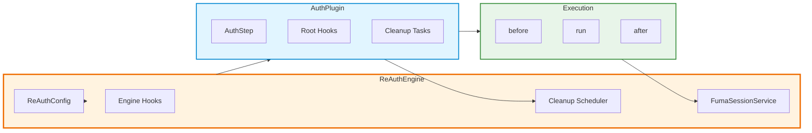

## High-Level Map



ReAuth does **not** expose a flow router. Everything runs through plugins, steps, and their associated hooks.

## Engine Configuration

`ReAuthConfig` is the only required input to construct an engine:

```ts
export type ReAuthConfig = {
  dbClient: FumaClient;
  plugins?: AuthPlugin[];
  tokenFactory?: () => string;
  authHooks?: AuthHook[];
  sessionHooks?: AuthHook[];
  enableCleanupScheduler?: boolean;
  getUserData: (
    subjectId: string,
    orm: OrmLike,
  ) => Promise<Record<string, any>>;
  deviceValidator?: (
    storedDeviceInfo: Record<string, any>,
    currentDeviceInfo: Record<string, any>,
  ) => boolean | Promise<boolean>;
};
```

- `dbClient` must implement the Fuma client interface (see `packages/reauth/src/types.ts`).
- `plugins` is an ordered list; dependencies are managed by the author, not the engine.
- `authHooks` are engine-level hooks for step execution, while `sessionHooks` wrap session operations.
- `getUserData` hydrates JWKS payloads when distributed JWT verification is enabled.
- `enableCleanupScheduler` defaults to `true`; the scheduler runs plugin tasks in the background.

### Engine Entry Points

`ReAuthEngine` exposes these key methods:

- `executeStep(pluginName, stepName, input)` – core step executor with validation and hook orchestration.
- `runStep(...)` – alias that returns `AuthOutput` for backward compatibility.
- `createSessionFor(subjectType, subjectId, ttl?, deviceInfo?)` – issue sessions without touching the service directly.
- `checkSession(token, deviceInfo?)` – verify access tokens and hydrate subjects.
- `registerAuthHook(hook)` / `registerHook(hook)` – add engine-level hooks at runtime.
- `registerSessionHook(hook)` – extend session lifecycle behaviour.
- `registerSessionResolver(subjectType, resolver)` – teach the session service how to hydrate custom subjects.
- `registerCleanupTask(task)` – plug plugin maintenance jobs into the scheduler.
- `getService<T>('name')` and `getContainer()` – access Awilix registrations.
- `getOrm()` – resolve a Fuma ORM instance with the current database version.
- `getAllPlugins()`, `getPlugin(name)` – inspect registered plugins.
- `getUnifiedProfile(subjectId)` and `getIntrospectionData()` – expose aggregated runtime metadata for tooling and dashboards.

## Plugin API

Plugins describe configuration, steps, and optional lifecycle hooks:

```ts
export interface AuthPlugin<Cfg = any> {
  name: string;
  config: Cfg;
  initialize?: (engine: ReAuthEngine, config: Cfg) => Promise<void> | void;
  steps?: Array<AuthStep<Cfg>>;
  rootHooks?: RootStepHooks<Cfg>;
  getSensitiveFields?: () => string[];
  getProfile?: (
    subjectId: string,
    ctx: PluginProfileContext,
  ) => Promise<any> | any;
}
```

### Step Definition

```ts
export interface AuthStep<Cfg, I = AuthInput, O = AuthOutput> {
  name: string;
  description?: string;
  validationSchema?: Type<any>; // ArkType schema for input
  outputs?: Type<any>; // Optional ArkType schema for output
  run: (input: I, ctx: StepContext<Cfg>) => Promise<O> | O;
  hooks?: StepHooks<Cfg, I, O>;
  inputs?: string[]; // Named inputs for documentation
  protocol?: StepProtocolMeta; // HTTP metadata used by adapters
}

export interface StepContext<Cfg> {
  engine: ReAuthEngine;
  config: Cfg;
}
```

Steps are transport-agnostic. HTTP adapters map routes to `plugin.step` pairs and use the ArkType schemas to coerce payloads.

### Hook Interfaces

- **Engine hooks**:

  ```ts
  export interface AuthHook {
    type: HooksType; // 'before' | 'after' | 'onError'
    pluginName?: string;
    steps?: string[];
    session?: boolean; // rarely used, prefer registerSessionHook
    universal?: boolean;
    fn: (
      data: AuthInput | AuthOutput,
      container: ReAuthCradle,
      error?: unknown,
    ) => Promise<AuthInput | AuthOutput | void> | AuthInput | AuthOutput | void;
  }
  ```

- **Plugin root hooks** (per plugin):

  ```ts
  export interface RootStepHooks<Cfg> {
    before?: (
      input: AuthInput,
      ctx: StepContext<Cfg>,
      step: AuthStep<Cfg>,
    ) => Promise<AuthInput> | AuthInput;
    after?: (
      output: AuthOutput,
      ctx: StepContext<Cfg>,
      step: AuthStep<Cfg>,
    ) => Promise<AuthOutput> | AuthOutput;
    onError?: (
      error: unknown,
      input: AuthInput,
      ctx: StepContext<Cfg>,
      step: AuthStep<Cfg>,
    ) => Promise<void> | void;
  }
  ```

- **Step hooks** (per step):

  ```ts
  export interface StepHooks<Cfg, I = AuthInput, O = AuthOutput> {
    before?: (input: I, ctx: StepContext<Cfg>) => Promise<void> | void;
    after?: (output: O, ctx: StepContext<Cfg>) => Promise<void> | void;
    onError?: (error: unknown, ctx: StepContext<Cfg>) => Promise<void> | void;
  }
  ```

Hook ordering is deterministic: engine → plugin root → step, then reversed on the way out. Engine-level `onError` hooks receive the original input so they can inspect or mutate it before rethrowing.

## Session API

`FumaSessionService` implements the `SessionService` interface defined in `types.ts`:

```ts
export interface SessionService {
  enableEnhancedFeatures(): void;
  enableJWKS(options: {
    issuer: string;
    keyRotationIntervalDays: number;
    keyGracePeriodDays: number;
    defaultAccessTokenTtlSeconds: number;
    defaultRefreshTokenTtlSeconds: number;
    enableRefreshTokenRotation: boolean;
  }): void;
  createSession(
    subjectType: string,
    subjectId: string,
    ttlSeconds?: number,
  ): Promise<Token>;
  createSessionWithMetadata?(
    subjectType: string,
    subjectId: string,
    options: CreateSessionOptions,
  ): Promise<Token>;
  verifySession(
    token: Token,
    deviceInfo?: Record<string, any>,
  ): Promise<{
    subject: any | null;
    token: Token | null;
    type?: 'jwt' | 'legacy';
    payload?: ReAuthJWTPayload;
  }>;
  destroySession(token: Token): Promise<void>;
  destroyAllSessions(subjectType: string, subjectId: string): Promise<void>;
  listSessionsFor?(
    subjectType: string,
    subjectId: string,
  ): Promise<
    Array<{
      sessionId: string;
      token: string;
      createdAt: Date;
      expiresAt: Date | null;
      deviceInfo?: Record<string, any>;
      metadata?: Record<string, any>;
    }>
  >;
  getPublicJWKS?(): Promise<{ keys: JWK[] }>;
  getJwkService(): EnhancedJWKSService | null;
}
```

Session hooks registered through `registerSessionHook` wrap `createSessionFor` and `checkSession` rather than the underlying service. Use them for analytics, device checks, or distributed cache invalidation.

### Session Resolvers

Subject resolvers hydrate custom user types:

```ts
engine.registerSessionResolver('organizationMember', {
  async getById(id, orm) {
    return orm.table('organizationMembers').findUnique(id);
  },
  sanitize(subject) {
    return { id: subject.id, organizationId: subject.organizationId };
  },
});
```

## Cleanup Scheduler API

Plugins add background jobs using `CleanupTask`:

```ts
export interface CleanupTask {
  name: string;
  pluginName: string;
  intervalMs: number;
  enabled: boolean;
  runner: (
    orm: OrmLike,
    config?: any,
  ) => Promise<{ cleaned: number; errors?: string[] }>;
}

export interface CleanupScheduler {
  registerTask(task: CleanupTask): void;
  start(): Promise<void>;
  stop(): Promise<void>;
  isRunning(): boolean;
  getRegisteredTasks(): CleanupTask[];
  setPluginConfig(pluginName: string, config: any): void;
}
```

`SimpleCleanupScheduler` runs in-process with setInterval. Tasks receive the plugin's configuration so they can respect user-defined thresholds (e.g., invitation expiry).

## Introspection Metadata

The engine exposes two read-only helpers:

```ts
engine.getStepInputs(pluginName, stepName); // => string[]
engine.getIntrospectionData(); // => { plugins: [...], generatedAt, version }
```

`getIntrospectionData` converts ArkType schemas to JSON Schema via `toJsonSchema()` so SDK generators or admin dashboards can render structured documentation.

## Putting It Together

```ts
import createReAuthEngine from '@re-auth/reauth';

const engine = createReAuthEngine({
  dbClient,
  plugins: [emailPasswordPlugin, oauthPlugin, organizationPlugin],
  getUserData: async (subjectId, orm) => ({
    profile: await orm.table('users').findUnique(subjectId),
  }),
});

engine.registerAuthHook({
  type: 'before',
  universal: true,
  fn: async (input) => ({ ...input, requestedAt: new Date().toISOString() }),
});

await engine.executeStep('email-password', 'register', {
  email: 'alice@example.com',
  password: 'hunter2',
});
```

The engine stays transport-agnostic: adapters simply translate HTTP (or any protocol) into `executeStep` calls while benefiting from validation, hooks, and session helpers defined here.

## Next Steps

<Cards>
  <Card
    href="./engine-internals"
    title="Engine Internals"
    description="See how the engine walks through the hook pipeline"
  />
  <Card
    href="./plugin-development"
    title="Plugin Development"
    description="Author a custom plugin using AuthStep and RootStepHooks"
  />
  <Card
    href="../partial-integration"
    title="Partial Integration"
    description="Use specific plugins alongside an existing auth system"
  />
</Cards>
