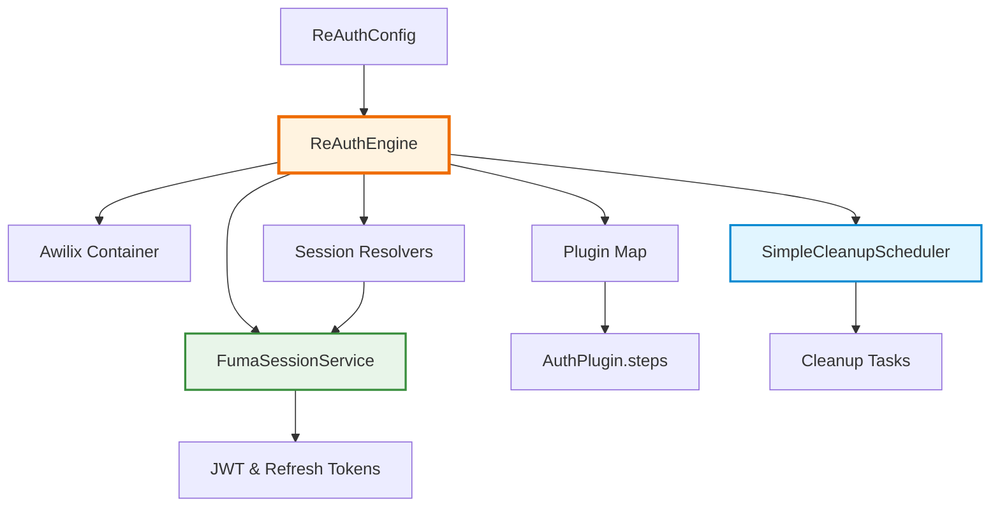
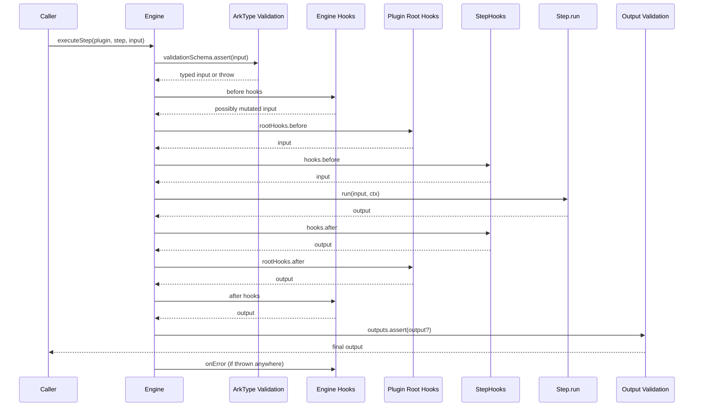

## Engine Architecture

The ReAuth engine is intentionally small. The class in `packages/reauth/src/engine.ts` wires four core subsystems together: the Awilix container, the plugin map, the session service, and the background cleanup scheduler.



### Initialization Path

<Steps>
  <Step>
    ### Construct the Awilix container

    ```ts
    this.container = createContainer({
      injectionMode: InjectionMode.CLASSIC,
      strict: true,
    });
    ```

    The container exposes `dbClient`, `sessionService`, `sessionResolvers`, and the engine instance itself for plugins to consume through dependency injection.

  </Step>

  <Step>
    ### Create session infrastructure

    - `InMemorySessionResolvers` manages subject resolvers for different subject types
    - `FumaSessionService` handles session CRUD, JWKS, and refresh token logic
    - Optional `deviceValidator` function allows custom device validation
    - Session service is configured with `getUserData` function for JWT payloads

  </Step>

  <Step>
    ### Register plugins

    ```ts
    for (const plugin of config.plugins || []) {
      this.registerPlugin(plugin);
    }
    ```

    `registerPlugin` stores the plugin in the plugin map, exposes its config to the cleanup scheduler, and calls `plugin.initialize?.(engine, config)` if defined.

  </Step>

  <Step>
    ### Attach engine and session hooks

    Global hooks from `config.authHooks` and `config.sessionHooks` are registered so they run for every step or session lifecycle event.

  </Step>

  <Step>
    ### Start background cleanup scheduler

    By default `SimpleCleanupScheduler` runs; set `enableCleanupScheduler: false` to disable background cleanup tasks.

  </Step>
</Steps>

## Step Execution Pipeline

`executeStep(pluginName, stepName, input)` is the only way the engine runs business logic. The implementation in `engine.ts` executes the following pipeline:



### Execution Context

Each step receives a context object `{ engine, config }`. Through `ctx.engine` you can:

- Resolve services with `getService<T>('serviceName')`.
- Access the DI container via `getContainer()`.
- Call other steps with `engine.runStep(...)` for composition.
- Fetch an ORM instance with `engine.getOrm()`.

### Hook Resolution Order

1. **Engine hooks** – configured via `registerAuthHook` or `authHooks`.
2. **Plugin root hooks** – `plugin.rootHooks.before/after/onError`.
3. **Step hooks** – `step.hooks.before/after/onError`.

On error the engine unwinds in reverse order: step → root → engine. Session hooks (`registerSessionHook`) are isolated and only run inside `createSessionFor` / `sessionService` workflows.

### Input and Output Validation

- Input: `step.validationSchema?.assert(input)` uses ArkType to coerce and validate before any hook runs.
- Output: `step.outputs?.assert(output)` verifies responses after all hooks complete. Both throw with human-readable summaries on failure.

## Session Lifecycle

ReAuth exposes high-level helpers so plugins or adapters can issue and verify sessions without touching the session service directly.

```ts
const token = await engine.createSessionFor(
  'subject',
  subjectId,
  ttl,
  deviceInfo,
);
const result = await engine.checkSession(token.accessToken);
```

### What `createSessionFor` Does

1. Runs **session hooks** with type `'before'`
2. Calls `FumaSessionService.createSession` or `createSessionWithMetadata`
3. Invokes `'after'` hooks with the new token pair
4. On error, runs `'onError'` hooks then rethrows

### `checkSession`

`checkSession` verifies JWT or legacy tokens, runs session hooks, and returns `{ subject, token, type, payload, valid }`. If JWKS is enabled, `type === 'jwt'` and `payload` contains the decoded token with data from `getUserData`.

### Enabling JWKS Sessions

```ts
engine.getSessionService().enableJWKS({
  issuer: 'https://auth.example.com',
  keyRotationIntervalDays: 30,
  keyGracePeriodDays: 7,
  defaultAccessTokenTtlSeconds: 900,
  defaultRefreshTokenTtlSeconds: 60 * 60 * 24 * 30,
  enableRefreshTokenRotation: true,
});
```

The session service automatically:

- Rotates signing keys at specified intervals
- Blacklists old refresh tokens when rotation is enabled
- Exposes a JWKS endpoint through HTTP adapters
- Manages key grace periods for smooth transitions

## Session Resolvers

Plugins can register subject resolvers so session verification can hydrate domain-specific data:

```ts
engine.registerSessionResolver('subject', {
  async getById(id, orm) {
    const subject = await orm.findFirst('subjects', {
      where: (b) => b('id', '=', id),
    });
    if (!subject) return null;

    // Optionally load related data
    const identity = await orm.findFirst('identities', {
      where: (b) => b('subject_id', '=', id),
    });

    return {
      id: subject.id,
      email: identity?.identifier,
      provider: identity?.provider,
      verified: identity?.verified,
    };
  },
  sanitize(subject) {
    // Remove sensitive fields before returning to client
    const { passwordHash, ...safe } = subject;
    return safe;
  },
});
```

Resolvers plug into `FumaSessionService.verifySession`, giving you full control over how subjects are loaded and sanitized before returning to callers. The `sanitize` function ensures sensitive data is never exposed to the client.

## Cleanup Scheduler

`SimpleCleanupScheduler` keeps plugin-owned tables tidy. Plugins register tasks via `engine.registerCleanupTask`:

```ts
engine.registerCleanupTask({
  name: 'expired-invitations',
  pluginName: 'organization',
  intervalMs: 1000 * 60 * 60, // hourly
  enabled: true,
  runner: async (orm, config) => {
    const { cleaned, errors } = await cleanupExpiredInvitations(orm, config);
    return { cleaned, errors };
  },
});
```

**Cleanup Task Features:**

- Tasks run at specified intervals using `setInterval`
- Plugin configs are stored so tasks can honor user-defined options
- Tasks return structured results with cleanup counts and error information
- Failed tasks are logged but don't stop the scheduler
- Enable or disable the scheduler with `enableCleanupScheduler` in `ReAuthConfig`

**Task Runner Interface:**

```ts
interface CleanupTask {
  name: string;
  pluginName: string;
  intervalMs: number;
  enabled: boolean;
  runner: (
    orm: OrmLike,
    config?: any,
  ) => Promise<{
    cleaned: number;
    errors?: string[];
  }>;
}
```

## Dependency Injection

Although plugins primarily use the `engine` instance, the Awilix container is accessible when you need fine-grained control:

```ts
const cradle = engine.getContainer().cradle;
const sessionService = cradle.sessionService; // FumaSessionService
const dbClient = cradle.dbClient; // FumaDB client
const sessionResolvers = cradle.sessionResolvers; // InMemorySessionResolvers
```

**Available Services:**

- `dbClient`: FumaDB client instance
- `sessionService`: FumaSessionService for session management
- `sessionResolvers`: InMemorySessionResolvers for subject hydration
- `engine`: The ReAuth engine instance itself

You can also resolve additional services with `engine.getService<T>('name')` if custom registrations are added during engine initialization.

## Introspection & Profiles

Two helper APIs expose runtime state:

### Unified Profile

`engine.getUnifiedProfile(subjectId)` gathers profile data from every plugin implementing `getProfile`:

```ts
const profile = await engine.getUnifiedProfile('user-123');
// Returns: {
//   'email-password': { emails: [...], password: { set: true } },
//   'session': { sessions: [...], totalSessions: 3 },
//   'admin': { roles: ['admin'], permissions: [...] }
// }
```

### Introspection Data

`engine.getIntrospectionData()` lists plugins and their steps with JSON Schema generated from ArkType:

```ts
const introspection = await engine.getIntrospectionData();
// Returns: {
//   plugins: [
//     {
//       name: 'email-password',
//       steps: [
//         {
//           name: 'register',
//           inputs: ['email', 'password'],
//           validationSchema: { /* JSON Schema */ },
//           protocol: { http: { method: 'POST', codes: {...} } }
//         }
//       ]
//     }
//   ],
//   generatedAt: '2024-01-15T10:30:00Z',
//   version: '1.0.0'
// }
```

These methods power documentation, SDK generation, and admin dashboards without invoking steps manually.

## Next Steps

<Cards>
  <Card
    href="./api-structure"
    title="API Structure"
    description="Explore TypeScript interfaces that define plugins, steps, and hooks"
  />
  <Card
    href="./plugin-development"
    title="Plugin Development"
    description="Author custom plugins that plug into this execution pipeline"
  />
  <Card
    href="../configuration"
    title="Configuration"
    description="See how to compose `ReAuthConfig` for your environment"
  />
</Cards>
