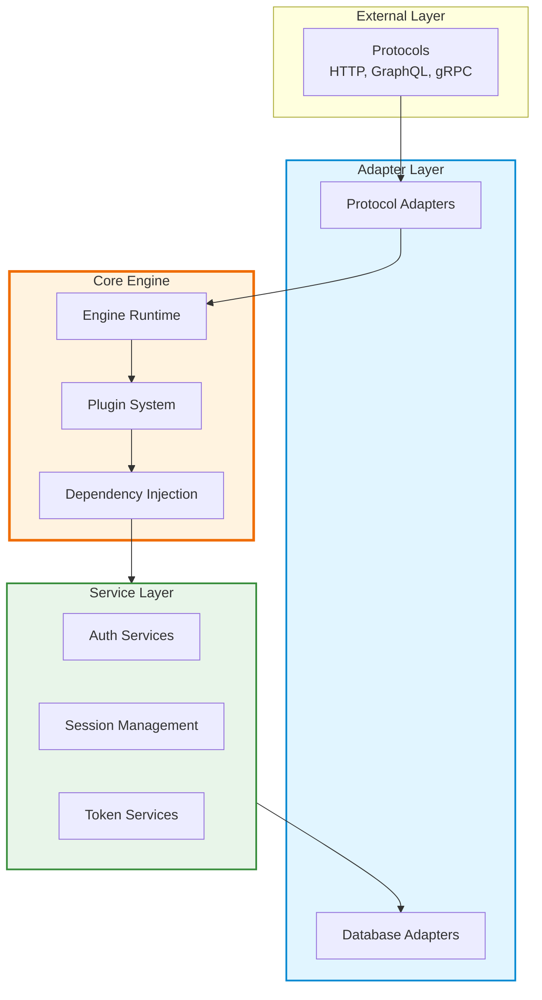

This section covers advanced topics for developers who want to understand the inner workings of ReAuth, build custom plugins, or contribute to the core engine.

## What You'll Learn

<Cards>
  <Card
    href="./plugin-development"
    title="Plugin Development"
    description="Learn how to build custom authentication plugins with schemas, controllers, services, and lifecycle hooks."
    icon="Package"
  />
  <Card
    href="./engine-internals"
    title="Engine Internals"
    description="Understand how the engine processes flows, manages state, and orchestrates plugins through dependency injection."
    icon="Cpu"
  />
  <Card
    href="./api-structure"
    title="API Structure"
    description="Explore the internal API architecture, interfaces, and design patterns used throughout ReAuth."
    icon="Code"
  />
</Cards>

## Prerequisites

Before diving into advanced topics, make sure you're familiar with:

- **Core Concepts**: Understanding of flows, policies, and the plugin system
- **TypeScript**: Strong grasp of TypeScript types, generics, and async patterns
- **Database Patterns**: Experience with ORMs, query builders, or raw SQL
- **Dependency Injection**: Familiarity with IoC containers (Awilix experience is a plus)

## When to Use This Section

### Building Custom Plugins

If you need authentication flows that aren't covered by the built-in plugins (email/password, OAuth, JWT, etc.), the Plugin Development guide will walk you through:

- Defining schemas with ArkType
- Implementing flow controllers
- Creating reusable services
- Hooking into the engine lifecycle
- Managing database migrations

### Contributing to ReAuth

Understanding the engine internals is essential if you want to:

- Fix bugs in the core engine
- Optimize performance
- Add new features
- Review pull requests
- Understand architectural decisions

### Integrating with Custom Systems

The API Structure documentation helps when you need to:

- Build adapters for new protocols (beyond HTTP)
- Create database adapters for unsupported databases
- Integrate with enterprise systems
- Build SDKs for other languages

## Architecture Overview

ReAuth follows a clean, layered architecture:

## Key Principles

### 1. Transport Agnostic

The engine knows nothing about HTTP, GraphQL, or any specific protocol. All transport concerns are handled by adapters.

### 2. Composable by Design

Plugins are independent modules that compose together. You can mix and match authentication flows without coupling.

### 3. Type-Safe Throughout

From schema validation to dependency injection, TypeScript types flow through the entire stack.

### 4. Observable & Extensible

Events, hooks, and policies provide extension points without modifying core code.

## Development Workflow

<Steps>
  <Step>
    ### Start with Plugin Development Learn how to build custom authentication
    flows by creating plugins. This is the most common advanced use case.
  </Step>

  <Step>
    ### Understand Engine Internals Once you're comfortable with plugins, dive
    into how the engine processes flows, manages state, and orchestrates
    plugins.
  </Step>

  <Step>
    ### Master the API Structure For deep customization or contributions,
    understand the internal APIs and design patterns used throughout ReAuth.
  </Step>
</Steps>

## Community & Support

- **GitHub Discussions**: Ask questions and share your custom plugins
- **Discord**: Real-time chat with other ReAuth developers
- **Contributing Guide**: Learn how to contribute to the project

## Next Steps

Choose a topic based on your needs:

<Cards>
  <Card
    href="./plugin-development"
    title="Build a Plugin"
    description="Start with plugin development if you need custom authentication flows"
  />
  <Card
    href="./engine-internals"
    title="Explore Internals"
    description="Understand the engine if you want to contribute or optimize"
  />
  <Card
    href="./api-structure"
    title="Study the API"
    description="Learn the internal APIs for deep customization"
  />
</Cards>
