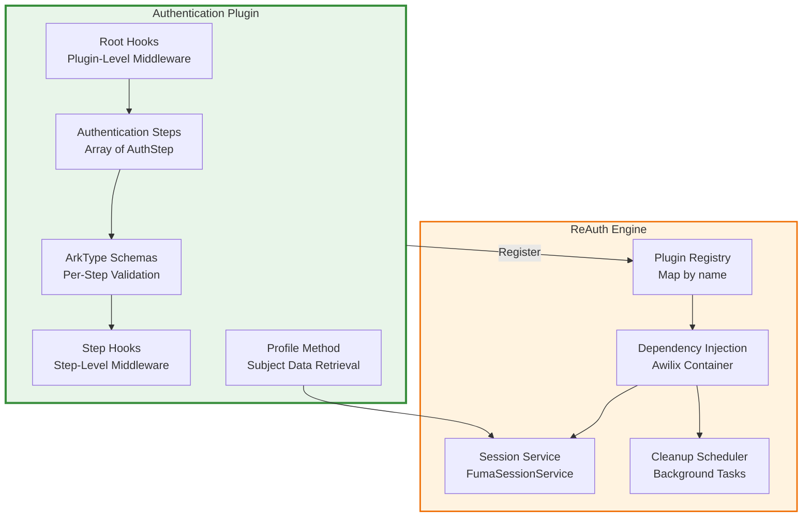
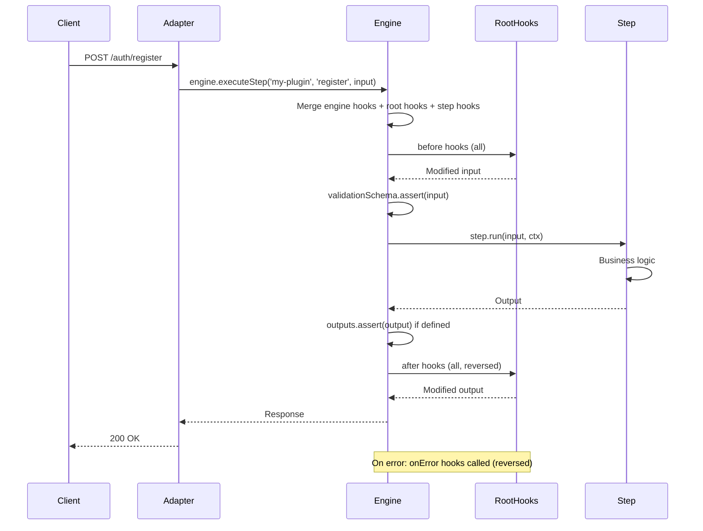

## Understanding Plugins

Plugins are self-contained authentication modules that extend the ReAuth engine with new authentication steps. Each plugin encapsulates:

- **Authentication steps** with their own schemas and business logic
- **ArkType validation schemas** for input/output validation
- **Lifecycle hooks** for intercepting step execution at root and step levels
- **Session resolvers** for custom subject hydration
- **Cleanup tasks** for background maintenance operations



## Plugin Architecture

### Basic Structure

Every plugin implements the `AuthPlugin<Cfg>` interface:

```typescript
import { type AuthPlugin, type AuthStep } from '@re-auth/reauth';
import { type } from 'arktype';

export interface MyPluginConfig {
  sessionTtlSeconds: number;
  requireVerification: boolean;
  // ... other config
}

export const myAuthPlugin = (
  config: Partial<MyPluginConfig>,
): AuthPlugin<MyPluginConfig> => {
  return {
    name: 'my-auth-plugin',
    config: {
      sessionTtlSeconds: 3600,
      requireVerification: true,
      ...config,
    },

    // Initialize hook - register session resolvers, cleanup tasks
    initialize(engine) {
      // Register session resolver for this plugin's subject type
      engine.registerSessionResolver('mySubjectType', {
        async getById(id: string, orm) {
          const subject = await orm.findFirst('subjects', {
            where: (b: any) => b('id', '=', id),
          });
          return subject;
        },
        sanitize(subject: any) {
          // Remove sensitive fields
          return subject;
        },
      });

      // Register background cleanup task
      engine.registerCleanupTask({
        name: 'my-cleanup',
        pluginName: 'my-auth-plugin',
        intervalMs: 60000, // 1 minute
        enabled: true,
        runner: async (orm, config) => {
          // Cleanup logic
          return { cleaned: 0 };
        },
      });
    },

    // Array of authentication steps
    steps: [registerStep, loginStep],

    // Root-level hooks (apply to all steps in this plugin)
    rootHooks: {
      before: async (input, ctx, step) => {
        // Pre-process input before step validation
        return input;
      },
      after: async (output, ctx, step) => {
        // Post-process output after step execution
        return output;
      },
      onError: async (error, input, ctx, step) => {
        // Handle errors for all steps
        console.error(`Error in ${step.name}:`, error);
      },
    },

    // Optional: retrieve profile data for a subject
    async getProfile(subjectId, ctx) {
      const orm = await ctx.engine.getOrm();
      // Fetch and return profile data
      return {
        /* profile data */
      };
    },

    // Optional: return sensitive field names for introspection filtering
    getSensitiveFields() {
      return ['password', 'passwordHash', 'verificationCode'];
    },
  };
};
```

### Step Structure

Each plugin contains an array of `AuthStep` objects. Steps are the core units of authentication logic:

```typescript
import {
  type AuthStep,
  type StepContext,
  type AuthOutput,
} from '@re-auth/reauth';
import { type } from 'arktype';

export interface MyPluginConfig {
  sessionTtlSeconds: number;
  requireVerification: boolean;
}

export type RegisterInput = {
  email: string;
  password: string;
  others?: Record<string, any>;
};

const registerValidation = type({
  email: 'string.email',
  password: 'string>8',
  'others?': 'object | undefined',
});

export const registerStep: AuthStep<MyPluginConfig, RegisterInput, AuthOutput> =
  {
    name: 'register',
    description: 'Register a new user with email and password',

    // ArkType validation schema for inputs
    validationSchema: registerValidation,

    // Optional: ArkType validation schema for outputs
    outputs: type({
      success: 'boolean',
      message: 'string',
      status: 'string',
      'subject?': type({
        id: 'string',
        email: 'string',
      }),
    }),

    // Protocol metadata for adapters (HTTP codes, auth requirements)
    protocol: {
      http: {
        method: 'POST',
        codes: { su: 200, ip: 400, ic: 400 },
        auth: false,
      },
    },

    // List of input field names for introspection
    inputs: ['email', 'password', 'others'],

    // Main execution logic
    async run(input, ctx) {
      const { email, password, others } = input;
      const orm = await ctx.engine.getOrm();

      // Your business logic here
      const subject = await orm.create('subjects', {});

      const token = await ctx.engine.createSessionFor(
        'subject',
        subject.id,
        ctx.config.sessionTtlSeconds,
      );

      return {
        success: true,
        message: 'Registration successful',
        status: 'su',
        subject: { id: subject.id, email },
        token,
      };
    },

    // Step-level hooks (optional)
    hooks: {
      before: async (input, ctx) => {
        // Pre-process before validation
      },
      after: async (output, ctx) => {
        // Post-process after execution
      },
      onError: async (error, ctx) => {
        // Handle errors for this step
      },
    },
  };
```

<Callout title="Type safety" type="success">
  ArkType provides both compile-time TypeScript types and runtime validation. Use `type.infer<typeof schema>` to extract TypeScript types. The `validationSchema.assert(input)` is called automatically before `run()`.
</Callout>

### Step Context

The `StepContext<Cfg>` provides access to the engine and plugin config:

```typescript
import type { StepContext } from '@re-auth/reauth';

export interface MyPluginConfig {
  sessionTtlSeconds: number;
  sendCode?: (subject: any, code: string, email: string, type: string) => Promise<void>;
}

export const registerStep: AuthStep<MyPluginConfig> = {
  name: 'register',
  async run(input, ctx: StepContext<MyPluginConfig>) {
    // Access the ReAuth engine
    const orm = await ctx.engine.getOrm();

    // Access plugin configuration
    const ttl = ctx.config.sessionTtlSeconds;

    // 1. Check if user exists
    const existing = await orm.findFirst('identities', {
      where: (b: any) => b.and(
        b('provider', '=', 'email'),
        b('identifier', '=', input.email)
      ),
    });

    if (existing) {
      return {
        success: false,
        message: 'User already exists',
        status: 'ip',
      };
    }

    // 2. Create subject and credentials
    const subject = await orm.create('subjects', {});
    await orm.create('credentials', {
      subject_id: subject.id,
      password_hash: await hashPassword(input.password),
    });

    // 3. Create identity
    const identity = await orm.create('identities', {
      subject_id: subject.id,
      provider: 'email',
      identifier: input.email,
      verified: false,
    });

    // 4. Send verification code if configured
    if (ctx.config.sendCode) {
      const code = generateCode();
      await ctx.config.sendCode({ id: subject.id }, code, input.email, 'verify');
    }

    // 5. Create session
    const token = await ctx.engine.createSessionFor(
      'subject',
      subject.id,
      ttl,
    );

    return {
      success: true,
      message: 'Registration successful',
      status: 'su',
      subject: { id: subject.id, email: input.email },
      token,
    };
  }
```

### Utility Functions

Create reusable utility functions for common operations:

```typescript
import { hash, verify } from '@node-rs/argon2';

// Password hashing utilities
export async function hashPassword(password: string): Promise<string> {
  return hash(password, {
    memoryCost: 19456,
    timeCost: 2,
    outputLen: 32,
    parallelism: 1,
  });
}

export async function verifyPasswordHash(
  hash: string,
  password: string,
): Promise<boolean> {
  return verify(hash, password);
}

// Code generation utilities
export function generateNumericCode(length: number = 6): string {
  let code = '';
  for (let i = 0; i < length; i++) {
    code += Math.floor(Math.random() * 10);
  }
  return code;
}

export function generateAlphanumericCode(length: number = 8): string {
  const chars = 'ABCDEFGHIJKLMNOPQRSTUVWXYZ0123456789';
  let code = '';
  for (let i = 0; i < length; i++) {
    code += chars.charAt(Math.floor(Math.random() * chars.length));
  }
  return code;
}
```

Use these utilities in your step implementations:

```typescript
import { hashPassword, generateNumericCode } from './utils';

export const registerStep: AuthStep<MyPluginConfig> = {
  name: 'register',
  async run(input, ctx) {
    const hashedPassword = await hashPassword(input.password);
    const verificationCode = generateNumericCode(6);

    // Use in your logic...
  },
};
```

### Lifecycle Hooks

ReAuth has a three-level hook system:

1. **Engine-level hooks** - Universal hooks registered in `ReAuthConfig.authHooks`
2. **Root hooks** - Plugin-level hooks in `plugin.rootHooks`
3. **Step hooks** - Step-specific hooks in `step.hooks`



#### Root Hooks (Plugin-Level)

Root hooks apply to all steps in a plugin:

```typescript
export const myPlugin = (
  config: MyPluginConfig,
): AuthPlugin<MyPluginConfig> => ({
  name: 'my-plugin',
  config,

  rootHooks: {
    // Called before validation for all steps
    before: async (input, ctx, step) => {
      console.log(`Executing step: ${step.name}`);

      // Normalize input
      if (input.email) {
        input.email = input.email.toLowerCase().trim();
      }

      // Add metadata
      input.metadata = {
        ...input.metadata,
        timestamp: new Date().toISOString(),
      };

      return input; // Must return modified input
    },

    // Called after execution for all steps
    after: async (output, ctx, step) => {
      console.log(`Completed step: ${step.name}`);

      // Add audit logging
      if (output.success && output.subject) {
        const orm = await ctx.engine.getOrm();
        await orm.create('audit_logs', {
          action: step.name,
          subject_id: output.subject.id,
          timestamp: new Date(),
        });
      }

      return output; // Must return modified output
    },

    // Called on error for all steps
    onError: async (error, input, ctx, step) => {
      console.error(`Error in ${step.name}:`, error);

      // Log errors to monitoring service
      await logToMonitoring({
        plugin: 'my-plugin',
        step: step.name,
        error: error instanceof Error ? error.message : String(error),
        input,
      });
    },
  },

  steps: [
    /* ... */
  ],
});
```

#### Step Hooks

Step-specific hooks only apply to that step:

```typescript
export const registerStep: AuthStep<MyPluginConfig> = {
  name: 'register',
  validationSchema: registerValidation,

  async run(input, ctx) {
    // Main logic
  },

  hooks: {
    // Called before this step's validation
    before: async (input, ctx) => {
      // Rate limiting specific to registration
      const orm = await ctx.engine.getOrm();
      const attempts = await orm.count('registration_attempts', {
        where: (b: any) =>
          b.and(
            b('email', '=', input.email),
            b('created_at', '>', new Date(Date.now() - 15 * 60 * 1000)),
          ),
      });

      if (attempts > 5) {
        throw new Error('Too many registration attempts. Try again later.');
      }
    },

    // Called after this step completes
    after: async (output, ctx) => {
      // Send welcome email only after successful registration
      if (output.success && output.subject) {
        await sendWelcomeEmail(output.subject.email);
      }
    },

    // Called if this step throws an error
    onError: async (error, ctx) => {
      console.error('Registration failed:', error);
    },
  },
};
```

#### Hook Execution Order

Hooks are executed in this order:

1. **Before hooks** (deterministic order):
   - Engine-level `before` hooks
   - Plugin root `before` hooks
   - Step `before` hooks

2. **Validation**: `validationSchema.assert(input)`

3. **Execution**: `step.run(input, ctx)`

4. **Output validation** (if defined): `outputs.assert(output)`

5. **After hooks** (reversed order):
   - Step `after` hooks
   - Plugin root `after` hooks
   - Engine-level `after` hooks

6. **On error** (if any hook/validation/run throws, reversed order):
   - Step `onError` hooks
   - Plugin root `onError` hooks
   - Engine-level `onError` hooks

## Session Resolvers

Plugins register session resolvers to hydrate subject data during session verification:

```typescript
export const myPlugin = (): AuthPlugin<MyPluginConfig> => ({
  name: 'my-plugin',

  initialize(engine) {
    // Register resolver for 'subject' type
    engine.registerSessionResolver('subject', {
      // Fetch subject by ID
      async getById(id: string, orm) {
        const subject = await orm.findFirst('subjects', {
          where: (b: any) => b('id', '=', id),
        });

        if (!subject) return null;

        // Optionally load related data
        const identity = await orm.findFirst('identities', {
          where: (b: any) => b('subject_id', '=', id),
        });

        return {
          id: subject.id,
          email: identity?.identifier,
          provider: identity?.provider,
          verified: identity?.verified,
        };
      },

      // Remove sensitive fields before returning to client
      sanitize(subject: any) {
        const { passwordHash, ...safe } = subject;
        return safe;
      },
    });
  },

  // ... rest of plugin
});
```

When `engine.checkSession(token)` is called, the resolver is used to hydrate the subject:

```typescript
const { subject, token: newToken } = await engine.checkSession(userToken);
// subject is the result of getById(), sanitized
```

## Background Cleanup Tasks

Plugins can register background cleanup tasks for maintenance operations:

```typescript
export const myPlugin = (): AuthPlugin<MyPluginConfig> => ({
  name: 'my-plugin',

  initialize(engine) {
    // Register cleanup task
    engine.registerCleanupTask({
      name: 'expired-tokens',
      pluginName: 'my-plugin',
      intervalMs: 5 * 60 * 1000, // Run every 5 minutes
      enabled: true,

      async runner(orm, config) {
        // Delete expired verification tokens
        const deleted = await orm.deleteMany('verification_tokens', {
          where: (b: any) => b('expires_at', '<', new Date()),
        });

        return {
          cleaned: deleted.count || 0,
          errors: [],
        };
      },
    });
  },

  // ... rest of plugin
});
```

The cleanup scheduler runs tasks in the background automatically when the engine starts.

## Profile Retrieval

The optional `getProfile` method allows plugins to provide custom profile data:

```typescript
export const emailPasswordPlugin = (): AuthPlugin<EmailPasswordConfig> => ({
  name: 'email-password',

  async getProfile(subjectId, ctx) {
    const orm = await ctx.engine.getOrm();

    // Get all email identities for this subject
    const emailIdentities = await orm.findMany('identities', {
      where: (b: any) =>
        b.and(b('subject_id', '=', subjectId), b('provider', '=', 'email')),
      orderBy: [['created_at', 'desc']],
    });

    const emails = emailIdentities.map((ident) => ({
      email: ident.identifier,
      verified: ident.verified,
      created_at: ident.created_at,
    }));

    // Check if password is set
    const creds = await orm.findFirst('credentials', {
      where: (b: any) => b('subject_id', '=', subjectId),
    });

    return {
      emails,
      password: { set: Boolean(creds?.password_hash) },
    };
  },

  // ... rest of plugin
});
```

Profile data is accessible through HTTP adapters or direct engine calls.

## Testing Plugins

Write tests for your plugin using Vitest:

```typescript
import { describe, it, expect, beforeEach } from 'vitest';
import createReAuthEngine from '@re-auth/reauth';
import { createTestDatabase } from './test-utils';
import { myAuthPlugin } from './my-plugin';

describe('MyAuthPlugin', () => {
  let engine: ReturnType<typeof createReAuthEngine>;
  let dbClient: any;

  beforeEach(async () => {
    dbClient = await createTestDatabase();

    engine = createReAuthEngine({
      dbClient,
      plugins: [myAuthPlugin({ sessionTtlSeconds: 3600 })],
      getUserData: async () => ({}),
    });
  });
  it('should register a new user', async () => {
    const result = await engine.executeStep('my-auth-plugin', 'register', {
      email: 'test@example.com',
      password: 'SecurePass123',
    });

    expect(result.success).toBe(true);
    expect(result.subject).toMatchObject({
      email: 'test@example.com',
    });
    expect(result.token).toBeDefined();
  });

  it('should reject duplicate email', async () => {
    // First registration
    await engine.executeStep('my-auth-plugin', 'register', {
      email: 'test@example.com',
      password: 'SecurePass123',
    });

    // Duplicate registration
    const result = await engine.executeStep('my-auth-plugin', 'register', {
      email: 'test@example.com',
      password: 'AnotherPass456',
    });

    expect(result.success).toBe(false);
    expect(result.message).toContain('already exists');
  });

  it('should verify session', async () => {
    const registerResult = await engine.executeStep(
      'my-auth-plugin',
      'register',
      {
        email: 'test@example.com',
        password: 'SecurePass123',
      },
    );

    const { subject, token } = await engine.checkSession(registerResult.token);

    expect(subject).toMatchObject({
      email: 'test@example.com',
    });
  });
});
```

## Best Practices

<Steps>
  <Step>
    ### Use TypeScript Strict Mode
    
    Enable strict type checking to catch errors early:
    
    ```json
    {
      "compilerOptions": {
        "strict": true,
        "noUncheckedIndexedAccess": true,
        "noImplicitOverride": true
      }
    }
    ```
  </Step>
  
  <Step>
    ### Validate All Input
    
    Never trust user input. Use ArkType schemas for comprehensive validation:
    
    ```typescript
    const schema = type({
      email: 'email',
      'password': 'string>8',
      'age?': 'number>=18',
    });
    ```
  </Step>
  
  <Step>
    ### Handle Errors Gracefully
    
    Use typed errors for better error handling:
    
    ```typescript
    export class UserExistsError extends Error {
      constructor(email: string) {
        super(`User with email ${email} already exists`);
        this.name = 'UserExistsError';
      }
    }
    ```
  </Step>
  
  <Step>
    ### Document Your Plugin
    
    Provide clear documentation with examples:
    
    ```typescript
    /**
     * Custom authentication plugin with email verification.
     * 
     * @example
     * ```ts
     * const engine = createReAuthEngine({
     *   dbClient,
     *   plugins: [
     *     myAuthPlugin({
     *       requireVerification: true,
     *       sessionTtlSeconds: 3600,
     *     }),
     *   ],
     *   getUserData: async () => ({}),
     * });
     * ```
     */
    export const myAuthPlugin = (options: Partial<MyPluginConfig>): AuthPlugin<MyPluginConfig> => {
      // ...
    };
    ```
  </Step>
</Steps>

## Example: SMS Authentication Plugin

Here's a complete example of an SMS-based authentication plugin:

```typescript
import {
  type AuthPlugin,
  type AuthStep,
  type StepContext,
  type AuthOutput,
} from '@re-auth/reauth';
import { type } from 'arktype';

// ============= Types and Config =============

export interface SMSAuthConfig {
  apiKey: string;
  from: string;
  sessionTtlSeconds: number;
  codeExpiresIn: number; // milliseconds
}

// ============= Validation Schemas =============

const sendCodeValidation = type({
  phoneNumber: /^\+[1-9]\d{1,14}$/,
  'others?': 'object | undefined',
});

const verifyCodeValidation = type({
  phoneNumber: /^\+[1-9]\d{1,14}$/,
  code: /^\d{6}$/,
  'others?': 'object | undefined',
});

// ============= Utility Functions =============

function generateCode(): string {
  return Math.floor(100000 + Math.random() * 900000).toString();
}

async function sendSMS(
  phoneNumber: string,
  code: string,
  config: SMSAuthConfig,
): Promise<void> {
  // Integrate with Twilio, AWS SNS, etc.
  console.log(`Sending code ${code} to ${phoneNumber}`);
  // await twilioClient.messages.create({ to: phoneNumber, from: config.from, body: `Your code: ${code}` });
}

// ============= Steps =============

const sendCodeStep: AuthStep<SMSAuthConfig> = {
  name: 'send-code',
  description: 'Send SMS verification code',
  validationSchema: sendCodeValidation,
  protocol: {
    http: {
      method: 'POST',
      codes: { su: 200, ic: 400 },
      auth: false,
    },
  },
  inputs: ['phoneNumber', 'others'],

  async run(input, ctx: StepContext<SMSAuthConfig>) {
    const { phoneNumber, others } = input;
    const orm = await ctx.engine.getOrm();
    const code = generateCode();

    // Store code with expiration
    const expiresAt = new Date(Date.now() + ctx.config.codeExpiresIn);

    await orm.create('sms_verification_codes', {
      phone_number: phoneNumber,
      code,
      expires_at: expiresAt,
    });

    // Send SMS
    await sendSMS(phoneNumber, code, ctx.config);

    return {
      success: true,
      message: 'Verification code sent',
      status: 'su',
      others,
    };
  },
};

const verifyCodeStep: AuthStep<SMSAuthConfig> = {
  name: 'verify-code',
  description: 'Verify SMS code and create session',
  validationSchema: verifyCodeValidation,
  protocol: {
    http: {
      method: 'POST',
      codes: { su: 200, ip: 400, unf: 404 },
      auth: false,
    },
  },
  inputs: ['phoneNumber', 'code', 'others'],

  async run(input, ctx: StepContext<SMSAuthConfig>) {
    const { phoneNumber, code, others } = input;
    const orm = await ctx.engine.getOrm();

    // Verify code
    const verification = await orm.findFirst('sms_verification_codes', {
      where: (b: any) =>
        b.and(b('phone_number', '=', phoneNumber), b('code', '=', code)),
      orderBy: [['created_at', 'desc']],
    });

    if (!verification) {
      return {
        success: false,
        message: 'Invalid verification code',
        status: 'ip',
        others,
      };
    }

    if (new Date(verification.expires_at) < new Date()) {
      return {
        success: false,
        message: 'Verification code expired',
        status: 'ip',
        others,
      };
    }

    // Find or create user
    let identity = await orm.findFirst('identities', {
      where: (b: any) =>
        b.and(b('provider', '=', 'sms'), b('identifier', '=', phoneNumber)),
    });

    let subjectId: string;

    if (!identity) {
      // Create new subject
      const subject = await orm.create('subjects', {});
      subjectId = subject.id;

      // Create identity
      identity = await orm.create('identities', {
        subject_id: subjectId,
        provider: 'sms',
        identifier: phoneNumber,
        verified: true, // Phone verified via SMS
      });
    } else {
      subjectId = identity.subject_id;
    }

    // Delete used code
    await orm.deleteMany('sms_verification_codes', {
      where: (b: any) => b('id', '=', verification.id),
    });

    // Create session
    const token = await ctx.engine.createSessionFor(
      'subject',
      subjectId,
      ctx.config.sessionTtlSeconds,
    );

    return {
      success: true,
      message: 'Login successful',
      status: 'su',
      subject: {
        id: subjectId,
        phoneNumber,
        provider: 'sms',
      },
      token,
      others,
    };
  },
};

// ============= Plugin Definition =============

export const smsAuthPlugin = (
  config: Partial<SMSAuthConfig>,
): AuthPlugin<SMSAuthConfig> => ({
  name: 'sms-auth',

  config: {
    apiKey: '',
    from: '',
    sessionTtlSeconds: 3600,
    codeExpiresIn: 10 * 60 * 1000, // 10 minutes
    ...config,
  },

  initialize(engine) {
    // Register session resolver
    engine.registerSessionResolver('subject', {
      async getById(id: string, orm) {
        const subject = await orm.findFirst('subjects', {
          where: (b: any) => b('id', '=', id),
        });
        return subject;
      },
      sanitize(subject: any) {
        return subject;
      },
    });

    // Register cleanup task for expired codes
    engine.registerCleanupTask({
      name: 'expired-sms-codes',
      pluginName: 'sms-auth',
      intervalMs: 5 * 60 * 1000, // 5 minutes
      enabled: true,

      async runner(orm) {
        const deleted = await orm.deleteMany('sms_verification_codes', {
          where: (b: any) => b('expires_at', '<', new Date()),
        });

        return {
          cleaned: deleted.count || 0,
        };
      },
    });
  },

  steps: [sendCodeStep, verifyCodeStep],

  // Root hooks for all steps
  rootHooks: {
    before: async (input, ctx, step) => {
      console.log(`[SMS Auth] Executing step: ${step.name}`);
      return input;
    },

    after: async (output, ctx, step) => {
      // Log successful operations
      if (output.success) {
        console.log(`[SMS Auth] ${step.name} successful`);
      }
      return output;
    },

    onError: async (error, input, ctx, step) => {
      console.error(`[SMS Auth] Error in ${step.name}:`, error);
    },
  },

  async getProfile(subjectId, ctx) {
    const orm = await ctx.engine.getOrm();

    const identity = await orm.findFirst('identities', {
      where: (b: any) =>
        b.and(b('subject_id', '=', subjectId), b('provider', '=', 'sms')),
    });

    return {
      phoneNumber: identity?.identifier,
      verified: identity?.verified,
    };
  },

  getSensitiveFields() {
    return ['code', 'apiKey'];
  },
});
```

**Usage:**

```typescript
import createReAuthEngine from '@re-auth/reauth';
import { kyselyAdapter } from 'fumadb/adapters/kysely';
import { smsAuthPlugin } from './sms-auth-plugin';

// Setup database client
const client = factory.client(
  kyselyAdapter({ provider: 'sqlite', db: kysely }),
);

const engine = createReAuthEngine({
  dbClient: {
    version: async () => await client.version(),
    orm: (version: any) => client.orm(version),
  },
  plugins: [
    smsAuthPlugin({
      apiKey: process.env.SMS_API_KEY,
      from: '+1234567890',
      sessionTtlSeconds: 3600,
    }),
  ],
  getUserData: async () => ({}),
});

// Send code
await engine.executeStep('sms-auth', 'send-code', {
  phoneNumber: '+15551234567',
});

// Verify code
const result = await engine.executeStep('sms-auth', 'verify-code', {
  phoneNumber: '+15551234567',
  code: '123456',
});
```

## Next Steps

<Cards>
  <Card
    href="./engine-internals"
    title="Engine Internals"
    description="Understand how the engine processes flows and manages plugins"
  />
  <Card
    href="./api-structure"
    title="API Structure"
    description="Learn about the engine's internal API architecture"
  />
  <Card
    href="../plugins"
    title="Built-in Plugins"
    description="Explore the official plugins shipped with ReAuth"
  />
</Cards>
