## Architecture

The ReAuth engine separates authentication concerns into three core layers:

1. **Database Layer**: FumaDB-based persistence with versioned schemas and plugin-specific tables
2. **Plugin Layer**: Composable authentication flows (email/password, OAuth, JWT, admin, session, etc.)
3. **Hook System**: Multi-level middleware (engine, plugin, step) for extending and intercepting flows

The engine is **transport-agnostic** - the same configuration runs in Node.js, Deno, Bun, or edge environments without modification.


<Callout title="Transport agnostic by design" type="info">
  Run the same engine configuration across Node, Deno, Bun, or edge runtimes
  without changing flow logic. Adapters only translate requests, not the
  business rules.
</Callout>

## The ReAuth Philosophy

### A Universal Authentication Pattern

ReAuth is **not just a TypeScript library**—it's a **new standard for building authentication platforms** that transcends language and ecosystem boundaries. The pattern separates authentication into three universal concerns that every system needs:

```mermaid
flowchart TB
    subgraph Pattern["ReAuth Universal Pattern"]
        direction TB
        Logic["🧠 Business Logic<br/>(Transport Agnostic)"]
        Protocol["🔌 Protocol Layer<br/>(HTTP, GraphQL, gRPC, etc.)"]
        Storage["💾 Storage Layer<br/>(SQL, NoSQL, KV, etc.)"]

        Logic -.->|"Adapts to"| Protocol
        Logic -.->|"Adapts to"| Storage
    end

    subgraph Implementations["Language Implementations"]
        TS["TypeScript/JavaScript<br/>@re-auth/reauth"]
        Go["Go<br/>go-reauth (future)"]
        Rust["Rust<br/>reauth-rs (future)"]
        Python["Python<br/>pyreauth (future)"]
    end

    Pattern ==>|"Same Pattern"| Implementations

    style Pattern fill:#fff3e0,stroke:#ef6c00,stroke-width:3px
    style Logic fill:#e8f5e9,stroke:#388e3c,stroke-width:2px
    style Protocol fill:#e1f5ff,stroke:#0288d1,stroke-width:2px
    style Storage fill:#f3e5f5,stroke:#7b1fa2,stroke-width:2px
```



### Why This Pattern Matters

<Callout title="Language-agnostic by design" type="success">
  ReAuth defines a **protocol-independent authentication architecture** that any
  language can implement. The TypeScript implementation is the reference, but
  the pattern works in Go, Rust, Python, or any ecosystem.
</Callout>

#### 1. **Separation of Concerns**

Authentication logic should never be coupled to HTTP, GraphQL, or any specific protocol. ReAuth enforces this by:

- **Core Engine**: Pure business logic with zero transport dependencies
- **Protocol Adapters**: Thin translation layers that map protocols to engine operations
- **Storage Adapters**: Pluggable persistence without vendor lock-in


#### 2. **Composable Authentication Flows**

Instead of monolithic auth systems, ReAuth uses **plugins** that compose together:

- Email/Password + Email Verification + 2FA
- OAuth + Organizations + Custom Claims
- Passwordless + WebAuthn + Device Fingerprinting

Each plugin is a self-contained module with its own schema, validation, and business logic.

#### 3. **Runtime Independence**

The same authentication rules run in:

- **Node.js** backends
- **Deno** / **Bun** edge functions
- **Cloudflare Workers** / **Vercel Edge**
- **AWS Lambda** / **Google Cloud Functions**

No runtime-specific code in the core engine.

### Replicating ReAuth in Other Ecosystems

To implement ReAuth in another language, follow this blueprint:

<Steps>
  <Step>
    ### Define the Core Interfaces
    
    ```typescript
    interface AuthEngine {
      plugins: PluginRegistry;
      database: DatabaseAdapter;
      session: SessionManager;
      policies: PolicyRegistry;
    }
    
    interface AuthPlugin {
      name: string;
      schema: ValidationSchema;
      controller: FlowController;
      hooks: LifecycleHooks;
    }
    ```
  </Step>
  
  <Step>
    ### Implement Storage Adapters
    
    Create adapters for your ecosystem's popular databases:
    
    - Go: `pgx`, `gorm`, `ent`
    - Rust: `sqlx`, `diesel`, `sea-orm`
    - Python: `sqlalchemy`, `prisma`, `tortoise`
  </Step>
  
  <Step>
    ### Build Protocol Adapters
    
    Map protocol requests to engine operations:
    
    - HTTP frameworks (Express-like, Gin, Actix-web, FastAPI)
    - GraphQL servers (Apollo-like, gqlgen, async-graphql, Strawberry)
    - gRPC services (standard protobuf definitions)
  </Step>
  
  <Step>
    ### Create Core Plugins
    
    Start with universal authentication flows:
    
    - Email/Password
    - OAuth 2.0 / OIDC
    - JWT with JWKS
    - Session Management
  </Step>
  
  <Step>
    ### Follow the Lifecycle Pattern
    
    ```mermaid
    flowchart TD
        Start([Request]) --> Validate[1. Validate Input]
        Validate --> BeforeExec[2. Before Execute<br/>Policies & Guards]
        BeforeExec --> Execute[3. Execute Flow<br/>Core Logic]
        Execute --> AfterExec[4. After Execute<br/>Side Effects]
        AfterExec --> Response([Response])
        
        style Validate fill:#e3f2fd
        style BeforeExec fill:#fff3e0
        style Execute fill:#e8f5e9
        style AfterExec fill:#f3e5f5
    ```
  </Step>
</Steps>

### ReAuth as a Standard

The ReAuth pattern establishes a **universal authentication standard** by:

1. **Defining clear boundaries** between transport, logic, and storage
2. **Providing composable building blocks** (plugins) instead of monoliths
3. **Enabling cross-runtime consistency** through protocol-agnostic design
4. **Supporting incremental adoption** by allowing custom plugins and adapters

<Callout title="Cross-language compatibility" type="info">
  Different language implementations of ReAuth can **share the same database
  schema** and **interoperate seamlessly**. A Go backend and TypeScript edge
  function can authenticate users from the same user pool.
</Callout>

## Core Concepts

### Engine Configuration

The engine accepts a configuration object that defines persistence, plugins, and security settings:

```ts
import createReAuthEngine, {
  reauthDb,
  reauthDbVersions,
} from '@re-auth/reauth';
import { kyselyAdapter } from 'fumadb/adapters/kysely';
import emailPasswordPlugin, {
  emailPasswordSchema,
} from '@re-auth/reauth/plugins/email-password';
import sessionPlugin, { sessionSchema } from '@re-auth/reauth/plugins/session';

// Setup database with versioned schemas
const { schema: v1 } = reauthDb('1.0.1', [emailPasswordSchema, sessionSchema]);
const factory = reauthDbVersions([v1]);
const client = factory.client(
  kyselyAdapter({ provider: 'sqlite', db: kysely }),
);

export const engine = createReAuthEngine({
  dbClient: {
    version: async () => await client.version(),
    orm: (version: any) => client.orm(version),
  },
  plugins: [
    emailPasswordPlugin({
      sessionTtlSeconds: 3600, // 1 hour sessions
      enableRegistration: true,
      verifyEmail: true,
    }),
    sessionPlugin({
      cleanupIntervalMinutes: 30,
    }),
  ],
  authHooks: [
    // Engine-level hooks (run for all flows)
    {
      type: 'before',
      universal: true,
      fn: async (input, container) => {
        console.log('Before any auth flow');
        return input;
      },
    },
  ],
  sessionHooks: [
    // Session-level hooks
    {
      type: 'after',
      fn: async (data, container) => {
        console.log('After session created');
        return data;
      },
    },
  ],
  getUserData: async (subjectId, orm) => {
    // Fetch additional user data for JWT payloads
    const user = await orm.findFirst('subjects', {
      where: (b) => b('id', '=', subjectId),
    });
    return { email: user?.email, name: user?.name };
  },
  enableCleanupScheduler: true, // Auto-cleanup expired sessions
});
```

**Key Configuration Options:**

- `dbClient`: FumaDB client for database operations
- `plugins`: Authentication flows that extend the engine
- `authHooks`: Engine-level hooks that run for all authentication flows
- `sessionHooks`: Hooks that run during session creation/verification
- `getUserData`: Function to fetch user data for JWT payloads and sessions
- `enableCleanupScheduler`: Background cleanup for expired tokens and sessions

### Plugins

Plugins encapsulate authentication flows as **steps**. Each plugin can define:

- **Steps**: Individual operations (register, login, verify-email, etc.) with input/output schemas.
- **Validation Schemas**: ArkType schemas for runtime input validation and TypeScript type inference.
- **Output Schemas**: Optional ArkType schemas for output validation.
- **Hooks**: Step-level (`before`, `after`, `onError`) and plugin-level root hooks.
- **Database Tables**: Custom tables and relations via FumaDB schema plugins.

Plugins are composable and can depend on each other. ReAuth ships with:

<Cards>
  <Card
    title="Email + Password"
    description="Traditional email/password authentication with verification"
  />
  <Card
    title="Username"
    description="Username-based authentication without email requirements"
  />
  <Card
    title="Email or Username"
    description="Flexible authentication supporting both methods"
  />
  <Card
    title="Phone"
    description="SMS-based authentication with verification codes"
  />
  <Card
    title="Session"
    description="Session management and lifecycle operations"
  />
  <Card title="JWT" description="JSON Web Token management with JWKS support" />
  <Card
    title="Admin"
    description="User management, roles, and administrative operations"
  />
  <Card
    title="API Key"
    description="API key authentication for service-to-service communication"
  />
</Cards>

You can also author custom plugins by implementing the `AuthPlugin` interface and registering hooks in `engine.plugins.use()`.

### Hooks System

ReAuth provides a flexible hooks system at three levels:

<Steps>
  <Step>
    ### Engine-Level Hooks
    
    Global hooks that run for all authentication flows:
    
    ```ts
    const engine = createReAuthEngine({
      dbClient,
      authHooks: [
        {
          type: 'before',
          universal: true,
          fn: async (input, container) => {
            // Rate limiting, logging, etc.
            console.log('Before any auth step');
            return input;
          },
        },
      ],
      getUserData: async (subjectId, orm) => ({}),
    });
    ```
  </Step>
  
  <Step>
    ### Plugin-Level Root Hooks
    
    Hooks that run for all steps within a plugin:
    
    ```ts
    const myPlugin = {
      name: 'my-plugin',
      rootHooks: {
        before: async (input, ctx, step) => {
          // Pre-process input for all plugin steps
          console.log(`Executing step: ${step.name}`);
          return input;
        },
        after: async (output, ctx, step) => {
          // Post-process output
          console.log(`Completed step: ${step.name}`);
          return output;
        },
        onError: async (error, input, ctx, step) => {
          // Handle errors
          console.error(`Error in ${step.name}:`, error);
        },
      },
      steps: [/* ... */],
    };
    ```
  </Step>
  
  <Step>
    ### Step-Level Hooks
    
    Hooks specific to individual steps:
    
    ```ts
    const registerStep = {
      name: 'register',
      hooks: {
        before: async (input, ctx) => {
          // Step-specific pre-processing
          console.log('Before registration');
        },
        after: async (output, ctx) => {
          // Step-specific post-processing  
          console.log('After registration');
        },
        onError: async (error, ctx) => {
          // Step-specific error handling
          console.error('Registration failed:', error);
        },
      },
      async run(input, ctx) {
        // Step implementation
      },
    };
    ```
  </Step>
  
  <Step>
    ### Session Hooks
    
    Special hooks for session lifecycle:
    
    ```ts
    const engine = createReAuthEngine({
      dbClient,
      sessionHooks: [
        {
          type: 'after',
          fn: async (data, container) => {
            // Track session creation
            analytics.track('session_created', { userId: data.subject?.id });
            return data;
          },
        },
      ],
      getUserData: async (subjectId, orm) => ({}),
    });
    ```
  </Step>
</Steps>

**Hook Execution Order:**

1. **Before hooks**: Engine → Plugin Root → Step
2. **Validation**: Input validation with ArkType schemas
3. **Execution**: Step implementation
4. **Output validation**: Output validation (if defined)
5. **After hooks**: Step → Plugin Root → Engine (reversed)
6. **On error**: Step → Plugin Root → Engine (reversed)

### Input & Output Validation

ReAuth uses **ArkType** for runtime validation with TypeScript type inference:

```ts
import { type } from 'arktype';

const registerSchema = type({
  email: 'email',
  password: 'string>8',
  'username?': 'string>3',
});

const step = {
  name: 'register',
  validationSchema: registerSchema, // Input validation
  outputs: type({
    success: 'boolean',
    subject: type({
      id: 'string.uuid',
      email: 'email',
    }),
  }), // Output validation (optional)
  async run(input, ctx) {
    // input is fully typed!
    const { email, password, username } = input;
    // ...
  },
};
```

**Benefits:**

- ✅ Runtime type safety
- ✅ Compile-time TypeScript types
- ✅ Automatic validation errors
- ✅ JSON Schema generation for introspection

## Data Persistence

The engine persists data through FumaDB with versioned schemas:

- **Core Tables**: `subjects`, `identities`, `credentials`, `sessions`
- **Plugin Tables**: Each plugin defines its own tables (e.g., `password_reset_codes`, `api_keys`, `audit_logs`)
- **Session Management**: Enhanced sessions with device tracking and metadata
- **JWT Support**: JWKS keys for distributed token verification

### Schema Versioning

ReAuth uses FumaDB's versioned schema system for safe database migrations:

```ts
// Version 1.0.1 - Initial schema
const { schema: v1 } = reauthDb('1.0.1', [emailPasswordSchema]);

// Version 1.0.2 - Add new plugin
const { schema: v2 } = extendSchemaVersion(v1Plugins, '1.0.2', [
  sessionSchema,
  adminSchema,
]);

// Register all versions
const factory = reauthDbVersions([v1, v2]);
```

This allows:

- Zero-downtime deployments
- Safe plugin additions
- Rollback capabilities
- Multiple client version support

## Observability & Monitoring

ReAuth provides multiple ways to monitor and observe authentication flows:

### Engine Hooks for Logging

```ts
const engine = createReAuthEngine({
  dbClient,
  authHooks: [
    {
      type: 'before',
      universal: true,
      fn: async (input, container) => {
        // Log all authentication attempts
        telemetry.track('auth.attempt', {
          plugin: input.pluginName,
          step: input.stepName,
          timestamp: new Date().toISOString(),
        });
        return input;
      },
    },
  ],
  sessionHooks: [
    {
      type: 'after',
      fn: async (data, container) => {
        // Track session creation
        telemetry.track('session.created', {
          userId: data.subject?.id,
          timestamp: new Date().toISOString(),
        });
        return data;
      },
    },
  ],
  getUserData: async (subjectId, orm) => ({}),
});
```

### Plugin-Level Monitoring

```ts
const myPlugin = {
  name: 'my-plugin',
  rootHooks: {
    onError: async (error, input, ctx, step) => {
      // Log plugin-specific errors
      monitoring.captureError(error, {
        plugin: 'my-plugin',
        step: step.name,
        userId: input.subject?.id,
      });
    },
  },
  steps: [
    /* ... */
  ],
};
```

### Cleanup Task Monitoring

```ts
engine.registerCleanupTask({
  name: 'expired-tokens',
  pluginName: 'my-plugin',
  intervalMs: 60000,
  enabled: true,
  async runner(orm, config) {
    const result = await cleanupExpiredTokens(orm);

    // Log cleanup results
    telemetry.track('cleanup.completed', {
      task: 'expired-tokens',
      cleaned: result.cleaned,
      errors: result.errors?.length || 0,
    });

    return result;
  },
});
```

## Next steps

<Cards>
  <Card
    href="../http-adapters/overview"
    title="Map flows to HTTP"
    description="See how adapters expose engine routes across Express, Fastify, Hono, and edge runtimes."
  />
  <Card
    href="./configuration"
    title="Tune the engine"
    description="Dive deeper into configuration options for plugins, sessions, and storage."
  />
  <Card
    href="../sdk-generator"
    title="Generate clients"
    description="Create typed frontend SDKs from live engine introspection endpoints."
  />
</Cards>
