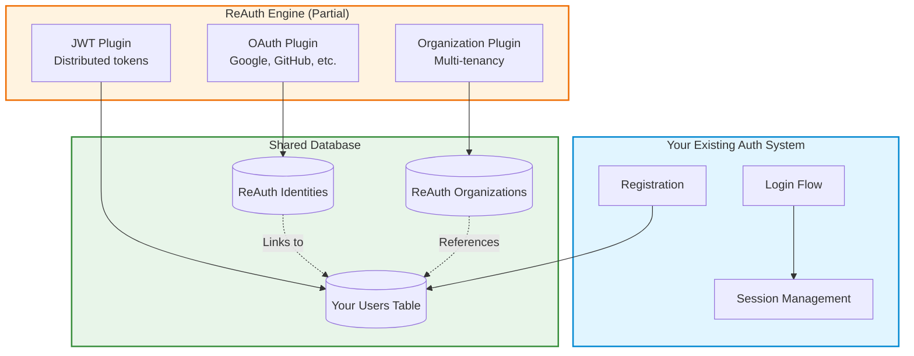

## Using ReAuth Alongside Existing Auth

ReAuth is flexible enough to **augment your existing authentication system** rather than replace it entirely. You can use specific plugins (like OAuth or Organizations) while keeping your current user management, sessions, and authentication flows.

This approach is ideal when:

- ✅ You have an established auth system you don't want to migrate
- ✅ You only need specific features (OAuth providers, multi-tenancy, JWT)
- ✅ You want to gradually adopt ReAuth without a big-bang rewrite
- ✅ You're building a SaaS with complex organization/tenant requirements



## Pattern 1: OAuth-Only Integration

Use ReAuth **only** for OAuth social login while keeping your existing email/password authentication.

### Setup

```ts
import createReAuthEngine, {
  reauthDb,
  reauthDbVersions,
} from '@re-auth/reauth';
import { kyselyAdapter } from 'fumadb/adapters/kysely';
import { oauthPlugin } from '@re-auth/reauth/plugins/oauth';
import {
  googleProvider,
  githubProvider,
} from '@re-auth/reauth/plugins/oauth/providers';

// Setup database with OAuth plugin schema
const { schema: v1 } = reauthDb('1.0.1', [oauthSchema]);
const factory = reauthDbVersions([v1]);
const client = factory.client(
  kyselyAdapter({ provider: 'sqlite', db: kysely }),
);

const reauth = createReAuthEngine({
  dbClient: {
    version: async () => await client.version(),
    orm: (version: any) => client.orm(version),
  },
  plugins: [
    oauthPlugin({
      providers: [
        googleProvider({
          clientId: process.env.GOOGLE_CLIENT_ID!,
          clientSecret: process.env.GOOGLE_CLIENT_SECRET!,
          redirectUri: 'https://yourapp.com/auth/google/callback',
        }),
        githubProvider({
          clientId: process.env.GITHUB_CLIENT_ID!,
          clientSecret: process.env.GITHUB_CLIENT_SECRET!,
          redirectUri: 'https://yourapp.com/auth/github/callback',
        }),
      ],
      // DON'T create ReAuth sessions - use your own
      sessionTtlSeconds: 0, // Disable ReAuth sessions
    }),
  ],
  getUserData: async (subjectId, orm) => {
    // Fetch from YOUR users table
    const user = await orm.findFirst('users', {
      where: (b) => b('id', '=', subjectId),
    });
    return { email: user?.email };
  },
});
```

### Usage Flow

<Steps>
  <Step>
    ### Start OAuth Flow
    
    ```ts
    // Your Express/Hono/Fastify endpoint
    app.get('/auth/:provider', async (c) => {
      const provider = c.req.param('provider'); // 'google' or 'github'
      
      const result = await reauth.executeStep('oauth', 'start', {
        provider,
        redirectUri: `https://yourapp.com/auth/${provider}/callback`,
      });
      
      // Redirect user to OAuth provider
      return c.redirect(result.redirect);
    });
    ```
  </Step>
  
  <Step>
    ### Handle Callback
    
    ```ts
    app.get('/auth/:provider/callback', async (c) => {
      const provider = c.req.param('provider');
      const code = c.req.query('code');
      const state = c.req.query('state');
      
      // ReAuth exchanges code for user profile
      const result = await reauth.executeStep('oauth', 'callback', {
        provider,
        code,
        state,
      });
      
      if (!result.success) {
        return c.redirect('/login?error=oauth_failed');
      }
      
      // ReAuth returns: { subject_id, provider, profile }
      const { subject_id, profile } = result;
      
      // Check if identity exists in YOUR database
      const identity = await db.query.identities.findFirst({
        where: (i, { eq }) => eq(i.provider_subject_id, subject_id),
      });
      
      if (identity) {
        // Existing user - create YOUR session
        const user = await db.query.users.findFirst({
          where: (u, { eq }) => eq(u.id, identity.subject_id),
        });
        
        // Use YOUR session system
        const sessionToken = await yourSessionManager.create(user.id);
        c.cookie('session', sessionToken, { httpOnly: true });
        
        return c.redirect('/dashboard');
      } else {
        // New user - register in YOUR system
        const newUser = await db.insert(users).values({
          email: profile.email,
          name: profile.name,
          avatar: profile.picture,
        }).returning();
        
        // Link OAuth identity to YOUR user
        await db.insert(identities).values({
          provider: profile.provider,
          provider_subject_id: subject_id,
          subject_id: newUser.id, // YOUR user ID
          profile: profile,
        });
        
        // Create YOUR session
        const sessionToken = await yourSessionManager.create(newUser.id);
        c.cookie('session', sessionToken, { httpOnly: true });
        
        return c.redirect('/onboarding');
      }
    });
    ```
  </Step>
  
  <Step>
    ### Link OAuth to Existing Accounts
    
    ```ts
    // Allow logged-in users to link OAuth providers
    app.post('/settings/link/:provider', async (c) => {
      const userId = c.get('userId'); // From YOUR session
      const provider = c.req.param('provider');
      
      const result = await reauth.executeStep('oauth', 'link', {
        provider,
        subject_id: userId, // YOUR user ID
        redirectUri: `https://yourapp.com/settings/link/${provider}/callback`,
      });
      
      return c.redirect(result.redirect);
    });
    ```
  </Step>
</Steps>

<Callout title="Key Point" type="success">
  ReAuth handles OAuth flows and stores identities, but **YOU** control user
  registration, sessions, and permissions. ReAuth becomes a utility for OAuth
  management.
</Callout>

## Pattern 2: Organizations/Multi-tenancy Only

Use ReAuth's organization plugin to add multi-tenancy to your existing auth system.

### Setup

```ts
import createReAuthEngine, {
  reauthDb,
  reauthDbVersions,
} from '@re-auth/reauth';
import { kyselyAdapter } from 'fumadb/adapters/kysely';
import { organizationPlugin } from '@re-auth/reauth/plugins/organization';

// Setup database with organization plugin schema
const { schema: v1 } = reauthDb('1.0.1', [organizationSchema]);
const factory = reauthDbVersions([v1]);
const client = factory.client(
  kyselyAdapter({ provider: 'sqlite', db: kysely }),
);

const reauth = createReAuthEngine({
  dbClient: {
    version: async () => await client.version(),
    orm: (version: any) => client.orm(version),
  },
  plugins: [
    organizationPlugin({
      maxOrganizationsPerUser: 10,
      allowHierarchy: true, // Parent/child orgs
      defaultRole: 'member',
      availableRoles: ['owner', 'admin', 'member', 'viewer'],
      invitationTtlDays: 7,

      // Don't use ReAuth's email plugin - use yours
      useEmailPlugin: false,
      getEmail: async (subjectId, orm) => {
        // Fetch email from YOUR users table
        const user = await orm.findFirst('users', {
          where: (b) => b('id', '=', subjectId),
        });
        return user?.email || null;
      },
    }),
  ],
  getUserData: async (subjectId, orm) => {
    const user = await orm.findFirst('users', {
      where: (b) => b('id', '=', subjectId),
    });
    return { email: user?.email, name: user?.name };
  },
});
```

### Usage Flow

<Steps>
  <Step>
    ### Create Organization
    
    ```ts
    app.post('/organizations', async (c) => {
      const userId = c.get('userId'); // From YOUR auth
      const { name, description } = await c.req.json();
      
      const result = await reauth.executeStep('organization', 'create-organization', {
        subject_id: userId, // YOUR user ID
        name,
        description,
      });
      
      return c.json(result);
    });
    ```
  </Step>
  
  <Step>
    ### Invite Members
    
    ```ts
    app.post('/organizations/:orgId/invites', async (c) => {
      const userId = c.get('userId');
      const orgId = c.req.param('orgId');
      const { email, role } = await c.req.json();
      
      // Check if user is admin (YOUR permission system)
      const canInvite = await yourPermissions.check(userId, orgId, 'invite_members');
      if (!canInvite) {
        return c.json({ error: 'Unauthorized' }, 403);
      }
      
      const result = await reauth.executeStep('organization', 'invite-member', {
        subject_id: userId,
        organization_id: orgId,
        email,
        role,
      });
      
      // ReAuth generates invitation token and stores it
      // Now send email using YOUR email system
      if (result.success && result.invitation_token) {
        await yourEmailService.send({
          to: email,
          subject: `You've been invited to join ${result.organization_name}`,
          template: 'organization-invite',
          data: {
            inviteLink: `https://yourapp.com/invites/${result.invitation_token}`,
            orgName: result.organization_name,
          },
        });
      }
      
      return c.json(result);
    });
    ```
  </Step>
  
  <Step>
    ### Accept Invitation
    
    ```ts
    app.post('/invites/:token/accept', async (c) => {
      const userId = c.get('userId'); // From YOUR auth
      const token = c.req.param('token');
      
      const result = await reauth.executeStep('organization', 'accept-invitation', {
        subject_id: userId,
        invitation_token: token,
      });
      
      if (result.success) {
        // User is now a member of the organization
        return c.json({ 
          message: 'Invitation accepted',
          organization: result.organization 
        });
      }
      
      return c.json({ error: result.message }, 400);
    });
    ```
  </Step>
  
  <Step>
    ### List User's Organizations
    
    ```ts
    app.get('/me/organizations', async (c) => {
      const userId = c.get('userId');
      
      const result = await reauth.executeStep('organization', 'list-organizations', {
        subject_id: userId,
      });
      
      return c.json(result.organizations);
    });
    ```
  </Step>
  
  <Step>
    ### Check Organization Permissions
    
    ```ts
    // Middleware to check if user belongs to organization
    async function requireOrgMember(c, next) {
      const userId = c.get('userId');
      const orgId = c.req.param('orgId');
      
      const result = await reauth.executeStep('organization', 'get-organization', {
        subject_id: userId,
        organization_id: orgId,
      });
      
      if (!result.success || !result.is_member) {
        return c.json({ error: 'Not a member of this organization' }, 403);
      }
      
      // Store for downstream handlers
      c.set('organization', result.organization);
      c.set('userRole', result.user_role);
      
      await next();
    }
    ```
  </Step>
</Steps>

<Callout title="Key Point" type="success">
  ReAuth manages organization structure, memberships, and invitations. **YOU**
  handle user authentication, email sending, and integrate org permissions into
  your existing authorization system.
</Callout>

## Pattern 3: JWT for Distributed Services

Use ReAuth's JWT plugin to issue tokens that **other services** can verify without calling back to your auth server.

### Setup

```ts
import createReAuthEngine, {
  reauthDb,
  reauthDbVersions,
} from '@re-auth/reauth';
import { kyselyAdapter } from 'fumadb/adapters/kysely';
import { jwtPlugin } from '@re-auth/reauth/plugins/jwt';

// Setup database with JWT plugin schema
const { schema: v1 } = reauthDb('1.0.1', [jwtSchema]);
const factory = reauthDbVersions([v1]);
const client = factory.client(
  kyselyAdapter({ provider: 'sqlite', db: kysely }),
);

const reauth = createReAuthEngine({
  dbClient: {
    version: async () => await client.version(),
    orm: (version: any) => client.orm(version),
  },
  plugins: [
    jwtPlugin({
      issuer: 'https://auth.yourapp.com',
      keyRotationIntervalDays: 30,
      keyGracePeriodDays: 7,
      defaultAccessTokenTtlSeconds: 900, // 15 minutes
      defaultRefreshTokenTtlSeconds: 2592000, // 30 days
      enableRefreshTokenRotation: true,
    }),
  ],
  getUserData: async (subjectId, orm) => {
    const user = await orm.findFirst('users', {
      where: (b) => b('id', '=', subjectId),
    });
    return {
      id: user?.id,
      email: user?.email,
      role: user?.role,
    };
  },
});

// Enable JWT sessions
reauth.getSessionService().enableJWKS({
  issuer: 'https://auth.yourapp.com',
  keyRotationIntervalDays: 30,
  keyGracePeriodDays: 7,
  defaultAccessTokenTtlSeconds: 900,
  defaultRefreshTokenTtlSeconds: 2592000,
  enableRefreshTokenRotation: true,
});
```

### Usage Flow

<Steps>
  <Step>
    ### Issue JWT After Login
    
    ```ts
    app.post('/login', async (c) => {
      const { email, password } = await c.req.json();
      
      // Use YOUR authentication logic
      const user = await yourAuth.verifyCredentials(email, password);
      if (!user) {
        return c.json({ error: 'Invalid credentials' }, 401);
      }
      
      // Create JWT session via ReAuth
      const token = await reauth.createSessionFor(
        'user', // subject type
        user.id, // YOUR user ID
        900 // 15 minutes TTL
      );
      
      // token = { accessToken, refreshToken }
      return c.json({
        accessToken: token.accessToken,
        refreshToken: token.refreshToken,
        expiresIn: 900,
      });
    });
    ```
  </Step>
  
  <Step>
    ### Verify JWT in Microservices
    
    ```ts
    // In your API service (separate from auth service)
    import { createRemoteJWKSet, jwtVerify } from 'jose';
    
    const JWKS = createRemoteJWKSet(
      new URL('https://auth.yourapp.com/.well-known/jwks.json')
    );
    
    async function verifyJWT(token: string) {
      try {
        const { payload } = await jwtVerify(token, JWKS, {
          issuer: 'https://auth.yourapp.com',
        });
        
        // payload contains user data from getUserData
        return {
          userId: payload.sub,
          email: payload.email,
          role: payload.role,
        };
      } catch (error) {
        throw new Error('Invalid token');
      }
    }
    
    // Middleware
    app.use('/*', async (c, next) => {
      const authHeader = c.req.header('Authorization');
      if (!authHeader?.startsWith('Bearer ')) {
        return c.json({ error: 'Unauthorized' }, 401);
      }
      
      const token = authHeader.slice(7);
      
      try {
        const user = await verifyJWT(token);
        c.set('user', user);
        await next();
      } catch (error) {
        return c.json({ error: 'Invalid token' }, 401);
      }
    });
    ```
  </Step>
  
  <Step>
    ### Refresh Tokens
    
    ```ts
    app.post('/refresh', async (c) => {
      const { refreshToken } = await c.req.json();
      
      // Verify and rotate refresh token
      const session = await reauth.checkSession(refreshToken);
      
      if (!session.valid) {
        return c.json({ error: 'Invalid refresh token' }, 401);
      }
      
      // ReAuth automatically rotates tokens
      return c.json({
        accessToken: session.token.accessToken,
        refreshToken: session.token.refreshToken,
        expiresIn: 900,
      });
    });
    ```
  </Step>
</Steps>

<Callout title="Key Point" type="success">
  ReAuth manages JWT signing, JWKS rotation, and token verification. Your
  microservices verify tokens **locally** using public keys from JWKS endpoint -
  no database queries needed!
</Callout>

## Pattern 4: Combining Multiple Plugins

You can combine OAuth + Organizations + JWT for a complete partial integration:

```ts
const reauth = createReAuthEngine({
  dbClient: db,
  plugins: [
    // OAuth for social login
    oauthPlugin({
      providers: [googleProvider({}), githubProvider({})],
      sessionTtlSeconds: 0, // Don't create ReAuth sessions
    }),

    // Organizations for multi-tenancy
    organizationPlugin({
      useEmailPlugin: false,
      getEmail: async (subjectId, orm) => {
        // Use YOUR user table
        const user = await orm.findFirst('users', {
          where: (b) => b('id', '=', subjectId),
        });
        return user?.email || null;
      },
    }),

    // JWT for distributed token verification
    jwtPlugin({
      issuer: 'https://auth.yourapp.com',
      defaultAccessTokenTtlSeconds: 900,
    }),
  ],
  getUserData: async (subjectId, orm) => {
    const user = await orm.findFirst('users', {
      where: (b) => b('id', '=', subjectId),
    });

    // Include organization memberships in JWT
    const memberships = await orm.findMany('organization_memberships', {
      where: (b) =>
        b.and(b('subject_id', '=', subjectId), b('status', '=', 'active')),
    });

    return {
      id: user?.id,
      email: user?.email,
      organizations: memberships?.map((m) => ({
        id: m.organization_id,
        role: m.role,
      })),
    };
  },
});
```

## Database Considerations

### Required Tables

When using ReAuth partially, you only need tables for the plugins you use:

**OAuth Plugin:**

- `identities` - OAuth provider linkages
- `identity_profile` - OAuth profile data

**Organization Plugin:**

- `organizations` - Organization records
- `organization_memberships` - User-org relationships
- `organization_invitations` - Pending invitations
- `organization_roles_permissions` - Custom RBAC

**JWT Plugin:**

- `jwks_keys` - JWT signing keys for rotation

**Your Existing Tables:**

- `users` - YOUR user management (unchanged)
- `sessions` - YOUR session management (if not using JWT)

### Schema Integration

```sql
-- Example: Link ReAuth identities to YOUR users table
CREATE TABLE identities (
  id UUID PRIMARY KEY,
  provider VARCHAR(50) NOT NULL,
  provider_subject_id VARCHAR(255) NOT NULL,
  subject_id UUID NOT NULL REFERENCES users(id) ON DELETE CASCADE,
  -- YOUR users table
  profile JSONB,
  created_at TIMESTAMP DEFAULT NOW()
);

-- Example: Link organizations to YOUR users
CREATE TABLE organization_memberships (
  id UUID PRIMARY KEY,
  organization_id UUID NOT NULL REFERENCES organizations(id),
  subject_id UUID NOT NULL REFERENCES users(id) ON DELETE CASCADE,
  -- YOUR users table
  role VARCHAR(50) NOT NULL,
  status VARCHAR(20) DEFAULT 'active'
);
```

## Benefits of Partial Integration

<Cards>
  <Card title="Gradual Migration" icon="TrendingUp">
    Adopt ReAuth features incrementally without rewriting your entire auth
    system.
  </Card>
  <Card title="Best of Both Worlds" icon="Zap">
    Keep your battle-tested auth logic while adding advanced features like OAuth
    and multi-tenancy.
  </Card>
  <Card title="Reduced Risk" icon="Shield">
    No big-bang migration. Test ReAuth features in production alongside existing
    auth.
  </Card>
  <Card title="Flexibility" icon="Settings">
    Use ReAuth as a utility library, not a framework. You stay in control.
  </Card>
</Cards>

## Common Questions

<Accordions>
  <Accordion title="Can I use ReAuth's session management with my existing auth?" id="session-management">
    Yes! You can call `reauth.createSessionFor(type, id, ttl)` after YOUR
    authentication succeeds. ReAuth will manage the session/token lifecycle while
    you handle the initial auth.
  </Accordion>

<Accordion title="Do I need to migrate my users table?" id="migrate-users">
  No. ReAuth plugins link to your existing users via `subject_id` foreign keys.
  Your users table remains unchanged.
</Accordion>

<Accordion
  title="Can I disable ReAuth's automatic session creation?"
  id="disable-sessions"
>
  Yes. Set `sessionTtlSeconds: 0` in plugin configs to disable automatic session
  creation. You can still manually create sessions when needed.
</Accordion>

  <Accordion title="How do I handle email sending?" id="email-sending">
    When `useEmailPlugin: false`, ReAuth returns data (like invitation tokens) but
    doesn't send emails. You integrate with YOUR email service.
  </Accordion>
</Accordions>

## Next Steps

<Cards>
  <Card
    href="../plugins/oauth"
    title="OAuth Plugin"
    description="Detailed OAuth plugin configuration and provider setup"
  />
  <Card
    href="../plugins/organization"
    title="Organization Plugin"
    description="Complete guide to multi-tenancy and team management"
  />
  <Card
    href="../plugins/jwt"
    title="JWT Plugin"
    description="Distributed authentication with JWT and JWKS"
  />
</Cards>
