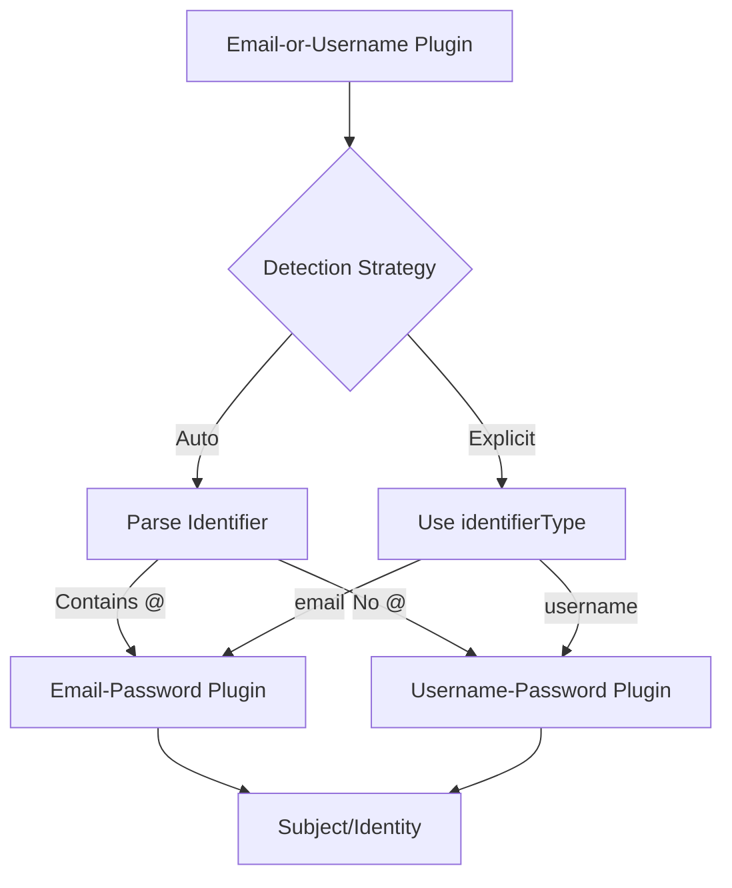

## Overview

The `email-or-username` plugin provides **hybrid authentication** - users can login with either their email address OR username. This offers maximum flexibility for different user preferences:

- **Email users** can login with `user@example.com`
- **Username users** can login with `johndoe`
- **Both identities** are linked to the same account
- **Automatic detection** identifies if input is email or username
- **Delegates to specialized plugins** for actual authentication

Key features:

- **Flexible login** with email or username
- **Automatic format detection** (auto mode) or explicit selection
- **Profile unification** combines data from both plugins
- **Leverages existing plugins** (email-password + username-password)
- **Inherits security features** from underlying plugins

<Callout title="⚠️ REQUIRED DEPENDENCIES" type="error">
  This plugin **REQUIRES** both `email-password` and `username-password` plugins to be registered **BEFORE** this plugin in your engine configuration. The engine will throw an error at initialization if either dependency is missing.

```ts
plugins: [
  emailPasswordPlugin({ ... }),    // ✅ Required - must come first
  usernamePasswordPlugin({ ... }), // ✅ Required - must come first
  emailOrUsernamePlugin({ ... }),  // Then this plugin
]
```

</Callout>

## Installation & Setup

```npm
npm i @re-auth/reauth
```

### Basic Configuration

```ts
import createReAuthEngine, {
  reauthDb,
  reauthDbVersions,
} from '@re-auth/reauth';
import { kyselyAdapter } from 'fumadb/adapters/kysely';
import emailPasswordPlugin, {
  emailPasswordSchema,
} from '@re-auth/reauth/plugins/email-password';
import usernamePasswordPlugin, {
  usernamePasswordSchema,
} from '@re-auth/reauth/plugins/username-password';
import emailOrUsernamePlugin, {
  emailOrUsernameSchema,
} from '@re-auth/reauth/plugins/email-or-username';

// Setup database schema and client
const { schema: v1 } = reauthDb('1.0.1', [
  emailPasswordSchema,
  usernamePasswordSchema,
  emailOrUsernameSchema,
]);
const factory = reauthDbVersions([v1]);
const client = factory.client(
  kyselyAdapter({ provider: 'sqlite', db: kysely }),
);

const engine = createReAuthEngine({
  dbClient: {
    version: async () => await client.version(),
    orm: (version: any) => client.orm(version),
  },
  plugins: [
    // Register both underlying plugins FIRST
    emailPasswordPlugin({
      verifyEmail: true,
      sessionTtlSeconds: 3600,
      sendEmail: async (to, type, payload) => {
        await sendEmail(to, type, payload);
      },
    }),
    usernamePasswordPlugin({
      loginOnRegister: true,
      sessionTtlSeconds: 3600,
    }),

    // Then register the hybrid plugin
    emailOrUsernamePlugin({
      detectionStrategy: 'auto', // Auto-detect email vs username
      loginOnRegister: true,
      sessionTtlSeconds: 3600,
    }),
  ],
  getUserData: async (subjectId, orm) => {
    const user = await orm.findFirst('subjects', {
      where: (b) => b('id', '=', subjectId),
    });
    return user ?? {};
  },
});
```

### With Explicit Strategy

```ts
emailOrUsernamePlugin({
  detectionStrategy: 'explicit', // User explicitly selects email or username
  loginOnRegister: true,
  sessionTtlSeconds: 3600,
});

// Usage with explicit strategy:
await engine.executeStep('email-or-username', 'login', {
  identifier: 'johndoe',
  identifierType: 'username', // 'email' | 'username'
  password: 'Password123!',
});
```

## Configuration

### EmailOrUsernameConfig

| Option              | Type                   | Default  | Description                                          |
| ------------------- | ---------------------- | -------- | ---------------------------------------------------- |
| `detectionStrategy` | `'auto' \| 'explicit'` | `'auto'` | How to determine if identifier is email or username. |
| `loginOnRegister`   | `boolean`              | `true`   | Create session token on registration (auto-login).   |
| `sessionTtlSeconds` | `number`               | `3600`   | Session token TTL in seconds (1 hour).               |

### Detection Strategies

**Auto Mode (Recommended):**

```ts
// Plugin automatically detects format:
// - Contains '@' → email
// - No '@' → username

await engine.executeStep('email-or-username', 'login', {
  identifier: 'user@example.com', // Detected as email
  password: 'Password123!',
});

await engine.executeStep('email-or-username', 'login', {
  identifier: 'johndoe', // Detected as username
  password: 'Password123!',
});
```

**Explicit Mode:**

```ts
// User interface provides separate fields or radio buttons

await engine.executeStep('email-or-username', 'login', {
  identifier: 'user@example.com',
  identifierType: 'email', // Explicitly specified
  password: 'Password123!',
});
```

## Authentication Steps

### 1. Register

**Step name:** `register`  
**HTTP:** `POST /auth/email-or-username/register`

Register a new user with email, username, and password.

**Input (Auto Mode):**

```ts
{
  email: string;
  username: string;
  password: string;
  others?: Record<string, any>;
}
```

**Input (Explicit Mode):**

```ts
{
  email: string;
  username: string;
  password: string;
  others?: Record<string, any>;
}
```

**Output:**

```ts
{
  success: boolean;
  status: 'su' | 'ic' | 'eq'; // success | invalid | exists
  message: string;
  token?: Token; // If loginOnRegister: true
  subject?: {
    id: string;
    email: string;
    username: string;
    verified: boolean; // true for username, false for unverified email
  };
  others?: Record<string, any>;
}
```

**Behavior:**

- Registers BOTH email and username identities for the user
- Delegates to `email-password:register` for email
- Delegates to `username-password:register` for username
- Links both identities to same subject
- Returns combined profile data

**Example:**

```tsx
function RegisterForm() {
  const [error, setError] = useState('');

  const handleSubmit = async (e: React.FormEvent<HTMLFormElement>) => {
    e.preventDefault();
    const formData = new FormData(e.currentTarget);

    const result = await engine.executeStep('email-or-username', 'register', {
      email: formData.get('email') as string,
      username: formData.get('username') as string,
      password: formData.get('password') as string,
      others: {
        displayName: formData.get('displayName') as string,
      },
    });

    if (result.success) {
      if (result.token) {
        localStorage.setItem('authToken', result.token.accessToken);
        window.location.href = '/dashboard';
      } else {
        // Email verification required
        window.location.href = '/verify-email';
      }
    } else {
      setError(result.message);
    }
  };

  return (
    <form onSubmit={handleSubmit}>
      <input name="email" type="email" placeholder="Email" required />
      <input name="username" type="text" placeholder="Username" required />
      <input name="password" type="password" placeholder="Password" required />
      <input name="displayName" type="text" placeholder="Display Name" />
      {error && <div className="error">{error}</div>}
      <button type="submit">Create Account</button>
    </form>
  );
}
```

### 2. Login

**Step name:** `login`  
**HTTP:** `POST /auth/email-or-username/login`

Authenticate with email or username + password.

**Input (Auto Mode):**

```ts
{
  identifier: string; // Email or username (auto-detected)
  password: string;
  others?: Record<string, any>;
}
```

**Input (Explicit Mode):**

```ts
{
  identifier: string;
  identifierType: 'email' | 'username';
  password: string;
  others?: Record<string, any>;
}
```

**Output:**

```ts
{
  success: boolean;
  status: 'su' | 'ic' | 'nv'; // success | invalid credentials | not verified
  message: string;
  token?: Token;
  subject?: {
    id: string;
    email?: string;
    username?: string;
    verified: boolean;
  };
  others?: Record<string, any>;
}
```

**Behavior:**

- Detects identifier type (auto mode) or uses explicit type
- Delegates to `email-password:login` or `username-password:login`
- Returns unified profile with both email and username (if available)

**Example (Auto Mode):**

```tsx
function LoginForm() {
  const [error, setError] = useState('');

  const handleSubmit = async (e: React.FormEvent<HTMLFormElement>) => {
    e.preventDefault();
    const formData = new FormData(e.currentTarget);

    const result = await engine.executeStep('email-or-username', 'login', {
      identifier: formData.get('identifier') as string, // Email or username
      password: formData.get('password') as string,
    });

    if (result.success) {
      localStorage.setItem('authToken', result.token.accessToken);
      window.location.href = '/dashboard';
    } else if (result.status === 'nv') {
      setError('Please verify your email before logging in.');
    } else {
      setError('Invalid email/username or password.');
    }
  };

  return (
    <form onSubmit={handleSubmit}>
      <h2>Login</h2>
      <input
        name="identifier"
        type="text"
        placeholder="Email or Username"
        required
      />
      <input name="password" type="password" placeholder="Password" required />
      {error && <div className="error">{error}</div>}
      <button type="submit">Login</button>
    </form>
  );
}
```

**Example (Explicit Mode):**

```tsx
function LoginForm() {
  const [loginMethod, setLoginMethod] = useState<'email' | 'username'>('email');

  const handleSubmit = async (e: React.FormEvent<HTMLFormElement>) => {
    e.preventDefault();
    const formData = new FormData(e.currentTarget);

    const result = await engine.executeStep('email-or-username', 'login', {
      identifier: formData.get('identifier') as string,
      identifierType: loginMethod,
      password: formData.get('password') as string,
    });

    if (result.success) {
      localStorage.setItem('authToken', result.token.accessToken);
      window.location.href = '/dashboard';
    }
  };

  return (
    <form onSubmit={handleSubmit}>
      <div>
        <label>
          <input
            type="radio"
            checked={loginMethod === 'email'}
            onChange={() => setLoginMethod('email')}
          />
          Email
        </label>
        <label>
          <input
            type="radio"
            checked={loginMethod === 'username'}
            onChange={() => setLoginMethod('username')}
          />
          Username
        </label>
      </div>

      <input
        name="identifier"
        type={loginMethod === 'email' ? 'email' : 'text'}
        placeholder={loginMethod === 'email' ? 'Email' : 'Username'}
        required
      />
      <input name="password" type="password" placeholder="Password" required />
      <button type="submit">Login</button>
    </form>
  );
}
```

### 3. Change Password

**Step name:** `change-password`  
**HTTP:** `POST /auth/email-or-username/change-password`  
**Auth:** Required

Change password for authenticated user (applies to both identities).

**Input:**

```ts
{
  token: Token;
  oldPassword: string;
  newPassword: string;
  others?: Record<string, any>;
}
```

**Output:**

```ts
{
  success: boolean;
  status: 'su' | 'ip' | 'ic'; // success | unauthorized | invalid
  message: string;
  token?: Token;
  others?: Record<string, any>;
}
```

**Behavior:**

- Changes password for the subject
- Password applies to BOTH email and username login methods
- Delegates to underlying plugin's change-password logic

**Example:**

```ts
const result = await engine.executeStep(
  'email-or-username',
  'change-password',
  {
    token: userToken,
    oldPassword: 'CurrentPassword123!',
    newPassword: 'NewPassword456!',
  },
);

if (result.success) {
  console.log('Password changed for both email and username login');
}
```

## Profile API

The plugin returns a unified profile combining data from both underlying plugins:

```ts
const profile = await engine.getUnifiedProfile('user-123');

// profile.plugins['email-or-username']
{
  identities: {
    email: {
      email: 'user@example.com',
      verified: true,
      created_at: '2025-10-03T10:00:00Z'
    },
    username: {
      username: 'johndoe',
      verified: true,
      created_at: '2025-10-03T10:00:00Z'
    }
  },
  password: { set: true },
  primaryIdentifier: 'email' // or 'username' based on last login
}

// Also available in individual plugin profiles:
// profile.plugins['email-password']
// profile.plugins['username-password']
```

## HTTP Adapter Integration

```ts
POST /auth/email-or-username/register         → email-or-username:register
POST /auth/email-or-username/login            → email-or-username:login
POST /auth/email-or-username/change-password  → email-or-username:change-password (auth)
```

## Architecture & Delegation



**Delegation Flow:**

1. **Registration**: Creates identities with BOTH plugins
2. **Login**: Detects type → delegates to appropriate plugin → returns unified profile
3. **Change Password**: Updates password in database (shared by both plugins)
4. **Verification**: Email verification handled by email-password plugin (username is always verified)
5. **Reset Password**: Handled by email-password plugin (username plugin doesn't support reset yet)

## Use Cases

### 1. Social Platform

```tsx
// Users can choose their preferred login method
function LoginPage() {
  return (
    <div>
      <h1>Welcome Back</h1>
      <p>Login with your email address or username</p>
      <LoginForm /> {/* Single input field, auto-detection */}
    </div>
  );
}
```

### 2. Gaming Community

```tsx
// Gamers prefer usernames, but email verification adds security
await engine.executeStep('email-or-username', 'register', {
  email: 'player@example.com', // For recovery
  username: 'ProGamer123', // For identity
  password: 'SecurePass123!',
});

// Players can login with either:
// - ProGamer123
// - player@example.com
```

### 3. Enterprise + Consumer Mix

```tsx
// Enterprise users with company email
await engine.executeStep('email-or-username', 'login', {
  identifier: 'john.doe@company.com',
  password: 'Password123!',
});

// Consumer users with memorable username
await engine.executeStep('email-or-username', 'login', {
  identifier: 'johndoe',
  password: 'Password123!',
});
```

## Security Considerations

<Steps>
  <Step>
    <h4>1. Username Enumeration</h4>
    <p>
      When a user tries to login, avoid revealing whether an email or username
      exists. Return generic "Invalid credentials" errors.
    </p>
  </Step>
  <Step>
    <h4>2. Email Verification</h4>
    <p>
      Email identities inherit verification requirements from email-password
      plugin. Username identities are always verified.
    </p>
  </Step>
  <Step>
    <h4>3. Password Recovery</h4>
    <p>
      Password reset is only available via email (from email-password plugin).
      Username-only accounts cannot reset passwords without a linked email.
    </p>
  </Step>
  <Step>
    <h4>4. Rate Limiting</h4>
    <p>
      Apply rate limiting to both email AND username login attempts to prevent
      brute force attacks.
    </p>
  </Step>
  <Step>
    <h4>5. Unique Constraints</h4>
    <p>
      Both email and username must be globally unique. A user cannot register
      with an existing email or username.
    </p>
  </Step>
</Steps>

## Complete Example: Advanced Login

```tsx
import { useState } from 'react';

function AdvancedLoginForm() {
  const [mode, setMode] = useState<'login' | 'register'>('login');
  const [loading, setLoading] = useState(false);
  const [error, setError] = useState('');

  const handleLogin = async (identifier: string, password: string) => {
    setLoading(true);
    setError('');

    try {
      const result = await engine.executeStep('email-or-username', 'login', {
        identifier,
        password,
      });

      if (result.success) {
        localStorage.setItem('authToken', result.token.accessToken);

        // Show which method was used
        const method = result.subject.email?.includes('@')
          ? 'email'
          : 'username';
        console.log(`Logged in via ${method}:`, result.subject);

        window.location.href = '/dashboard';
      } else if (result.status === 'nv') {
        setError('Please verify your email before logging in.');
        // Could redirect to resend verification page
      } else {
        setError('Invalid email/username or password.');
      }
    } catch (err) {
      setError('An error occurred. Please try again.');
    } finally {
      setLoading(false);
    }
  };

  const handleRegister = async (
    email: string,
    username: string,
    password: string,
  ) => {
    setLoading(true);
    setError('');

    try {
      const result = await engine.executeStep('email-or-username', 'register', {
        email,
        username,
        password,
      });

      if (result.success) {
        if (result.token) {
          localStorage.setItem('authToken', result.token.accessToken);
          window.location.href = '/dashboard';
        } else {
          // Email verification required
          window.location.href = `/verify-email?email=${encodeURIComponent(email)}`;
        }
      } else {
        setError(result.message);
      }
    } catch (err) {
      setError('An error occurred. Please try again.');
    } finally {
      setLoading(false);
    }
  };

  const handleSubmit = async (e: React.FormEvent<HTMLFormElement>) => {
    e.preventDefault();
    const formData = new FormData(e.currentTarget);

    if (mode === 'login') {
      await handleLogin(
        formData.get('identifier') as string,
        formData.get('password') as string,
      );
    } else {
      await handleRegister(
        formData.get('email') as string,
        formData.get('username') as string,
        formData.get('password') as string,
      );
    }
  };

  return (
    <div className="auth-container">
      <form onSubmit={handleSubmit}>
        <h2>{mode === 'login' ? 'Welcome Back' : 'Create Account'}</h2>

        {error && <div className="error">{error}</div>}

        {mode === 'register' ? (
          <>
            <input
              name="email"
              type="email"
              placeholder="Email"
              required
              disabled={loading}
            />
            <input
              name="username"
              type="text"
              placeholder="Username"
              pattern="[a-zA-Z0-9_-]{3,20}"
              required
              disabled={loading}
            />
          </>
        ) : (
          <input
            name="identifier"
            type="text"
            placeholder="Email or Username"
            required
            disabled={loading}
          />
        )}

        <input
          name="password"
          type="password"
          placeholder="Password"
          minLength={8}
          required
          disabled={loading}
        />

        <button type="submit" disabled={loading}>
          {loading
            ? 'Processing...'
            : mode === 'login'
              ? 'Login'
              : 'Create Account'}
        </button>

        <button
          type="button"
          onClick={() => {
            setMode(mode === 'login' ? 'register' : 'login');
            setError('');
          }}
          disabled={loading}
        >
          {mode === 'login'
            ? 'Need an account? Sign up'
            : 'Already have an account? Login'}
        </button>
      </form>

      {mode === 'login' && (
        <div className="help-links">
          <a href="/forgot-password">Forgot password?</a>
        </div>
      )}
    </div>
  );
}
```

## Next Steps

<Cards>
  <Card
    href="/docs/engine/plugins/email-password"
    title="Email + Password Plugin"
    description="Learn about the underlying email authentication plugin."
  />
  <Card
    href="/docs/engine/plugins/username"
    title="Username + Password Plugin"
    description="Learn about the underlying username authentication plugin."
  />
  <Card
    href="/docs/engine/plugins/organization"
    title="Organization Plugin"
    description="Add users (email or username) to organizations."
  />
</Cards>
