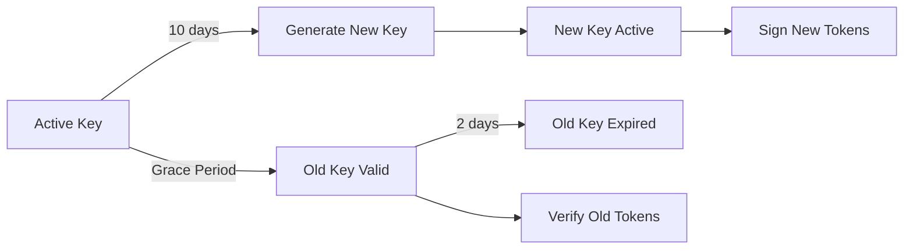
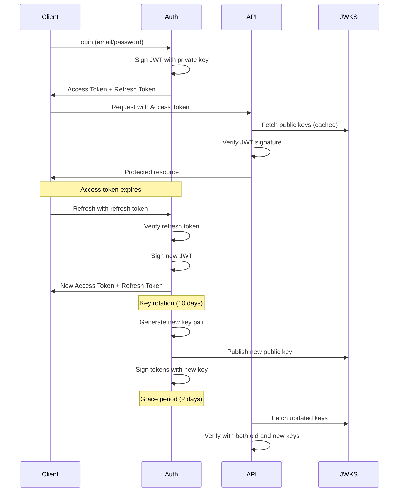

## Overview

The `jwt` plugin is the **cornerstone for distributed authentication** in ReAuth, enabling microservices and third-party applications to verify user sessions **without contacting the main auth server**. This is the primary reason for JWT support in ReAuth.

## 🎯 Main Focus: Distributed Token Verification

### OAuth 2.0 Client Registration

The plugin's **primary feature** is registering OAuth 2.0 clients (confidential and public) that can:

- **Verify tokens independently** using public JWKS keys
- **Refresh tokens on behalf of users** only then should the be auth server involved
- **Scale horizontally** without creating auth server bottlenecks
- **Support microservices** where each service validates tokens locally

### Why This Matters

**Without JWT Plugin:**

```
Client → Auth Server (verify token) ❌ Bottleneck
```

**With JWT Plugin:**

```
Client → Fetch JWKS once (cached) → Verify tokens locally ✅ Fast & Scalable
Client → Auth Server (refresh token only when expired) ✅ Minimal load
```

### Core Capabilities

**🔑 Confidential Clients** (Backend Services)

- Receive `client_id` and `client_secret` on registration
- Can refresh tokens on behalf of users
- Verify tokens using public JWKS (no auth server contact needed)
- Perfect for microservices, backend APIs, server-to-server communication

**🌐 Public Clients** (SPAs, Mobile Apps)

- Receive `client_id` only (no secret)
- Verify tokens using public JWKS
- Use PKCE for authorization code flow
- Perfect for single-page apps, mobile applications

### Additional Features

- **JWKS endpoints** for public key distribution at `/.well-known/jwks.json`
- **Automatic key rotation** with configurable intervals and grace periods
- **Refresh token rotation** for enhanced security
- **Token blacklisting** for immediate revocation
- **Background cleanup** for expired tokens and keys

<Callout title="🚀 Distributed Architecture" type="tip">
  Once clients fetch the JWKS keys (cached for hours), they can verify
  **millions of tokens** without contacting your auth server. This enables true
  horizontal scaling and eliminates the auth server as a bottleneck.
</Callout>

## Why Use the JWT Plugin?

### Problem: Centralized Auth Bottleneck

Without JWT, every token verification requires contacting your auth server:

```typescript
// ❌ Every request hits auth server
app.use(async (req, res, next) => {
  const token = req.headers.authorization?.split(' ')[1];
  const session = await authServer.verifyToken(token); // Network call!
  if (!session) return res.status(401).send('Unauthorized');
  req.user = session.user;
  next();
});

// Result: Auth server becomes bottleneck at scale
// - Single point of failure
// - High latency (network round-trip for every request)
// - Limited scalability
```

### Solution: Distributed Token Verification with JWT

**With JWT plugin, services verify tokens locally:**

```typescript
// ✅ Verify tokens locally using cached JWKS
import { jwtVerify, createRemoteJWKSClient } from 'jose';

const JWKS = createRemoteJWKSClient(
  new URL('https://auth.myapp.com/.well-known/jwks.json'),
);

app.use(async (req, res, next) => {
  const token = req.headers.authorization?.split(' ')[1];

  try {
    // Verify locally - NO auth server contact!
    const { payload } = await jwtVerify(token, JWKS);
    req.user = { id: payload.sub, scope: payload.scope };
    next();
  } catch (error) {
    res.status(401).send('Invalid token');
  }
});

// Result: Massive scalability
// - No auth server bottleneck
// - Near-zero latency (local verification)
// - Services scale independently
// - JWKS cached for hours
```

### Key Benefits

1. **🚀 Horizontal Scaling**: Services scale independently without auth server involvement
2. **⚡ Performance**: Token verification in microseconds (local crypto, no network)
3. **🔒 Security**: Asymmetric keys mean private keys never leave auth server
4. **🌐 Distributed**: Perfect for microservices, edge computing, multi-region deployments
5. **📉 Reduced Load**: Auth server only needed for login and token refresh

## Installation & Setup

```npm
npm i @re-auth/reauth
```

### Basic Configuration

```ts
import createReAuthEngine, {
  reauthDb,
  reauthDbVersions,
} from '@re-auth/reauth';
import { kyselyAdapter } from 'fumadb/adapters/kysely';
import jwtPlugin from '@re-auth/reauth/plugins/jwt';
import { jwtSchema } from '@re-auth/reauth/services';

// Setup database schema and client
const { schema: v1 } = reauthDb('1.0.1', [jwtSchema]);
const factory = reauthDbVersions([v1]);
const client = factory.client(
  kyselyAdapter({ provider: 'sqlite', db: kysely }),
);

const engine = createReAuthEngine({
  dbClient: {
    version: async () => await client.version(),
    orm: (version: any) => client.orm(version),
  },
  plugins: [
    jwtPlugin({
      issuer: 'https://auth.myapp.com',

      // Token lifetimes
      defaultAccessTokenTtlSeconds: 900, // 15 minutes
      defaultRefreshTokenTtlSeconds: 30 * 24 * 60 * 60, // 30 days

      // Key rotation
      keyRotationIntervalDays: 10,
      keyGracePeriodDays: 2,

      // Security features
      enableBlacklist: true,
      enableRefreshTokenRotation: true,

      // Cleanup
      cleanupIntervalMinutes: 60,
    }),
  ],
  getUserData: async (subjectId, orm) => {
    const user = await orm.findFirst('subjects', {
      where: (b) => b('id', '=', subjectId),
    });
    return user ?? {};
  },
});
```

### Production Configuration

```ts
jwtPlugin({
  issuer: process.env.JWT_ISSUER || 'https://auth.production.com',

  // Shorter access tokens for production
  defaultAccessTokenTtlSeconds: 600, // 10 minutes
  defaultRefreshTokenTtlSeconds: 7 * 24 * 60 * 60, // 7 days

  // More frequent key rotation
  keyRotationIntervalDays: 7, // Weekly rotation
  keyGracePeriodDays: 1, // 1-day grace period

  // Enhanced security
  enableBlacklist: true, // Allow immediate revocation
  enableRefreshTokenRotation: true, // Rotate on use
  enableLegacyTokenSupport: false, // Strict mode

  // More aggressive cleanup
  cleanupIntervalMinutes: 30,
});
```

## OAuth 2.0 Client Types

The JWT plugin's **primary purpose** is enabling distributed authentication through two client types:

### Confidential Clients (Backend Services)

**Use Cases:**

- 🔧 Microservices in your infrastructure
- 🔒 Backend APIs that need to verify user tokens
- 🤝 Server-to-server communication
- 📊 Internal admin tools and dashboards
- 🔄 Services that refresh tokens on behalf of users

**Capabilities:**

- Receive `client_id` + `client_secret` on registration
- Can authenticate themselves to refresh user tokens
- Verify tokens locally using cached JWKS keys
- No auth server contact needed for token verification

**Example Workflow:**

```typescript
// 1. Register confidential client (once)
const client = await engine.executeStep('jwt', 'register-client', {
  token: adminToken,
  client_type: 'confidential',
  name: 'User Service API',
});
// Store: client.client_id and client.client_secret

// 2. Fetch JWKS keys (cache for hours)
const jwks = await fetch('https://auth.myapp.com/.well-known/jwks.json');

// 3. Verify tokens locally - NO AUTH SERVER CONTACT
const { payload } = await jwtVerify(userToken, jwks);

// 4. Refresh tokens when needed
const newTokens = await refreshToken({
  client_id: client.client_id,
  client_secret: client.client_secret,
  refresh_token: userRefreshToken,
});
```

### Public Clients (Frontend Apps)

**Use Cases:**

- 📱 Mobile applications (iOS, Android, React Native)
- 🌐 Single-page applications (React, Vue, Angular)
- 💻 Desktop applications (Electron, Tauri)
- 🎮 Gaming clients

**Capabilities:**

- Receive `client_id` only (no secret for security)
- Verify tokens locally using public JWKS
- Use PKCE for secure authorization
- Cannot refresh tokens server-side (must use frontend flow)

**Example Workflow:**

```typescript
// 1. Register public client (once)
const client = await engine.executeStep('jwt', 'register-client', {
  token: adminToken,
  client_type: 'public',
  name: 'Mobile App',
});
// Store: client.client_id only

// 2. In your mobile app - verify tokens locally
import { jwtVerify, createRemoteJWKSClient } from 'jose';

const JWKS = createRemoteJWKSClient(
  new URL('https://auth.myapp.com/.well-known/jwks.json'),
);

// Verify WITHOUT contacting auth server
const { payload } = await jwtVerify(accessToken, JWKS);
console.log('User ID:', payload.sub); // Works offline!
```

### Comparison

| Feature                | Confidential Client | Public Client         |
| ---------------------- | ------------------- | --------------------- |
| **Client Secret**      | ✅ Yes              | ❌ No                 |
| **Security**           | Server-side only    | Can run in browser    |
| **Token Verification** | ✅ Local (JWKS)     | ✅ Local (JWKS)       |
| **Refresh Tokens**     | ✅ Server-side      | ⚠️ Frontend flow only |
| **Best For**           | Microservices, APIs | SPAs, Mobile apps     |
| **Auth Server Load**   | 📉 Minimal          | 📉 Minimal            |

## Configuration

### JWTPluginConfig

| Option                          | Type      | Default    | Description                                                        |
| ------------------------------- | --------- | ---------- | ------------------------------------------------------------------ |
| `issuer`                        | `string`  | `'reauth'` | JWT issuer claim (iss). Should be your app's domain. **Required**. |
| `defaultAccessTokenTtlSeconds`  | `number`  | `900`      | Access token TTL (15 minutes). Must be ≥60 seconds.                |
| `defaultRefreshTokenTtlSeconds` | `number`  | `2592000`  | Refresh token TTL (30 days). Must be ≥3600 seconds (1 hour).       |
| `keyRotationIntervalDays`       | `number`  | `10`       | Days between key rotations. Must be ≥1.                            |
| `keyGracePeriodDays`            | `number`  | `2`        | Days old keys remain valid after rotation. Cannot be negative.     |
| `enableBlacklist`               | `boolean` | `true`     | Enable token blacklist for revocation before expiration.           |
| `enableRefreshTokenRotation`    | `boolean` | `true`     | Issue new refresh token on each use (more secure).                 |
| `enableLegacyTokenSupport`      | `boolean` | `true`     | Support tokens signed with older keys during grace period.         |
| `cleanupIntervalMinutes`        | `number`  | `60`       | Cleanup task interval (1 hour). Must be ≥1 minute.                 |

## JWT Architecture

### Token Structure

**Access Token (JWT):**

```json
{
  "header": {
    "alg": "RS256",
    "typ": "JWT",
    "kid": "key-20251003-abc123"
  },
  "payload": {
    "iss": "https://auth.myapp.com",
    "sub": "user-123",
    "aud": "myapp",
    "exp": 1696334400,
    "iat": 1696333500,
    "jti": "token-uuid",
    "scope": "read write"
  }
}
```

**Refresh Token (Opaque):**

- Stored in database with reference to subject
- Used to obtain new access tokens
- Can be rotated on each use
- Supports family tracking for replay detection

### Key Rotation Flow



**Rotation Process:**

1. New key generated every `keyRotationIntervalDays`
2. New key becomes primary for signing
3. Old key remains valid for `keyGracePeriodDays`
4. Expired keys removed by cleanup task
5. JWKS endpoint always returns all valid keys

## Authentication Steps

### 1. Get JWKS

**Step name:** `get-jwks`  
**HTTP:** `GET /auth/jwt/get-jwks` or `GET /.well-known/jwks.json`

Retrieve public JWKS keys for JWT verification.

**Input:**

```ts
{
  client_id: string;
  client_secret?: string; // For confidential clients
  others?: Record<string, any>;
}
```

**Output:**

```ts
{
  success: boolean;
  status: 'su' | 'ic'; // success | error
  message: string;
  jwk?: JWK; // JSON Web Key
  others?: Record<string, any>;
}
```

**Behavior:**

- Returns public key(s) for JWT verification
- Used by clients to verify access tokens
- Typically exposed as a public endpoint
- Updates automatically on key rotation

**Example:**

```ts
// Fetch JWKS for token verification
const result = await engine.executeStep('jwt', 'get-jwks', {
  client_id: 'my-app-client',
});

if (result.success) {
  console.log('Public JWKS:', result.jwk);
  // Use JWKS to verify incoming JWTs
}
```

**Standard JWKS Endpoint:**

```ts
// Express middleware example
app.get('/.well-known/jwks.json', async (req, res) => {
  const sessionService = engine.getSessionService();
  const jwks = await sessionService.getPublicJWKS();
  res.json(jwks);
});

// Response format:
{
  "keys": [
    {
      "kty": "RSA",
      "use": "sig",
      "kid": "key-20251003-abc123",
      "alg": "RS256",
      "n": "xGOr...", // RSA modulus
      "e": "AQAB"    // RSA exponent
    }
  ]
}
```

### 2. Register Client ⭐ PRIMARY FEATURE

**Step name:** `register-client`  
**HTTP:** `POST /auth/jwt/register-client`  
**Auth:** Required

**This is the main entry point for distributed authentication.** Register OAuth 2.0 clients (microservices, third-party apps, mobile apps) that will verify tokens independently.

**Input:**

```ts
{
  token: Token;
  client_type: 'public' | 'confidential';
  name: string;
  description?: string;
  is_active?: boolean;
  others?: Record<string, any>;
}
```

**Output:**

```ts
{
  success: boolean;
  status: 'su' | 'ip' | 'ic'; // success | unauthorized | error
  message: string;
  token?: Token;
  client?: {
    id: string;
    client_secret: string; // Only returned once!
    name: string;
    description?: string;
    is_active?: boolean;
  };
  others?: Record<string, any>;
}
```

**Behavior:**

- Creates a new OAuth 2.0 client
- **Confidential clients** get a `client_secret` (returned only once)
- **Public clients** (SPAs, mobile apps) don't get secrets
- Client associated with authenticated subject

**Example:**

```ts
// Register a confidential client (backend service)
const result = await engine.executeStep('jwt', 'register-client', {
  token: adminToken,
  client_type: 'confidential',
  name: 'My Backend Service',
  description: 'Internal API service',
  is_active: true,
});

if (result.success) {
  console.log('Client ID:', result.client.id);
  console.log('Client Secret:', result.client.client_secret);
  // Store client_secret securely - it won't be shown again!
}
```

**Client Types:**

| Type           | Use Case                           | Secret Required | Examples                    |
| -------------- | ---------------------------------- | --------------- | --------------------------- |
| `confidential` | Backend services, servers          | ✅ Yes          | API services, microservices |
| `public`       | SPAs, mobile apps, browser clients | ❌ No           | React apps, mobile apps     |

## Profile API

```ts
const profile = await engine.getUnifiedProfile('user-123');

// profile.plugins['jwt']
{
  jwt_enabled: true,
  active_keys: 2, // Number of active signing keys
}
```

## HTTP Adapter Integration

```ts
GET  /auth/jwt/get-jwks         → jwt:get-jwks (public)
GET  /.well-known/jwks.json     → jwt:get-jwks (public)
POST /auth/jwt/register-client  → jwt:register-client (auth)
```

## Background Cleanup Tasks

The JWT plugin registers three background cleanup tasks:

### 1. Expired JWKS Keys

- **Task:** `expired-jwks-keys`
- **Interval:** Every `cleanupIntervalMinutes` (default: 60 minutes)
- **Purpose:** Remove keys older than grace period
- **Action:** Deletes expired keys from `jwks_keys` table

### 2. Blacklisted Tokens

- **Task:** `blacklisted-tokens`
- **Interval:** Every `cleanupIntervalMinutes * 2` (default: 2 hours)
- **Purpose:** Remove expired blacklisted tokens
- **Action:** Deletes blacklist entries for expired tokens
- **Enabled:** Only if `enableBlacklist: true`

### 3. Expired Refresh Tokens

- **Task:** `expired-refresh-tokens`
- **Interval:** Every `cleanupIntervalMinutes * 3` (default: 3 hours)
- **Purpose:** Remove expired refresh tokens
- **Action:** Deletes refresh tokens past their TTL

## Security Features

<Steps>
  <Step>
    ### 1. Token Blacklisting

    Immediately revoke tokens before their natural expiration. Useful for logout, security incidents, or permission changes.

    ```ts
    // Blacklist a token (logout)
    await sessionService.blacklistToken(token);

    // Verify will fail for blacklisted tokens
    const session = await engine.checkSession(token);
    // session.subject === null
    ```

  </Step>

  <Step>
    ### 2. Refresh Token Rotation

    Issue a new refresh token each time it's used. Prevents replay attacks and limits token lifetime.

    ```ts
    // On refresh:
    // 1. Verify old refresh token
    // 2. Issue new access + refresh tokens
    // 3. Invalidate old refresh token
    // 4. Track token families for replay detection
    ```

  </Step>

  <Step>
    ### 3. Key Rotation

    Regularly rotate signing keys to limit exposure if a key is compromised. Old keys remain valid during grace period.

  </Step>

  <Step>
    ### 4. Asymmetric Cryptography

    Private keys sign tokens (server-side only). Public keys verify tokens (can be distributed to clients).

  </Step>

  <Step>
    ### 5. Short-Lived Access Tokens

    Access tokens expire quickly (15 minutes default). Refresh tokens last longer but require secure storage.

  </Step>
</Steps>

## Use Cases

### 1. Microservices with Distributed Verification ⭐

**Scenario**: You have multiple microservices (User Service, Order Service, Payment Service) that all need to verify user authentication.

**Problem**: Without JWT, every request to every service requires contacting the auth server.

**Solution**: Each microservice verifies tokens locally using JWKS.

```ts
// ===== Auth Server Setup =====
const authEngine = createReAuthEngine({
  plugins: [
    emailPasswordPlugin({
      /* ... */
    }),
    jwtPlugin({
      issuer: 'https://auth.company.com',
      defaultAccessTokenTtlSeconds: 900, // 15 minutes
      keyRotationIntervalDays: 7,
    }),
  ],
});

// Register confidential client for each microservice
const userServiceClient = await authEngine.executeStep(
  'jwt',
  'register-client',
  {
    token: adminToken,
    client_type: 'confidential',
    name: 'User Service',
    description: 'Handles user profile operations',
  },
);

const orderServiceClient = await authEngine.executeStep(
  'jwt',
  'register-client',
  {
    token: adminToken,
    client_type: 'confidential',
    name: 'Order Service',
    description: 'Handles order processing',
  },
);

// ===== Each Microservice (User Service, Order Service, etc.) =====
import express from 'express';
import { jwtVerify, createRemoteJWKSClient } from 'jose';

const app = express();

// Fetch JWKS once, cache for hours (jose library handles caching)
const JWKS = createRemoteJWKSClient(
  new URL('https://auth.company.com/.well-known/jwks.json'),
);

// Middleware verifies tokens locally - NO auth server contact!
app.use(async (req, res, next) => {
  try {
    const token = req.headers.authorization?.split(' ')[1];
    if (!token) return res.status(401).json({ error: 'No token provided' });

    // ✅ Verify locally using cached JWKS - microsecond latency!
    const { payload } = await jwtVerify(token, JWKS, {
      issuer: 'https://auth.company.com',
    });

    req.user = {
      id: payload.sub,
      email: payload.email,
      scope: payload.scope,
    };
    next();
  } catch (error) {
    res.status(401).json({ error: 'Invalid token' });
  }
});

// All endpoints now have authenticated user
app.get('/api/users/profile', async (req, res) => {
  // req.user is already verified!
  const profile = await db.getUser(req.user.id);
  res.json(profile);
});

app.listen(3001);

// 🎯 Result:
// - Each service scales independently
// - Auth server only contacted for login and refresh
// - Token verification takes microseconds, not milliseconds
// - Services work even if auth server is temporarily down
```

### 2. Confidential Client with Token Refresh ⭐

**Scenario**: A backend service needs to make API calls on behalf of users, including refreshing their tokens.

```ts
// ===== Auth Server: Register Confidential Client =====
const client = await engine.executeStep('jwt', 'register-client', {
  token: adminToken,
  client_type: 'confidential',
  name: 'Background Job Service',
  description: 'Processes user data in background jobs',
});

// Store securely in environment variables
process.env.CLIENT_ID = client.client_id;
process.env.CLIENT_SECRET = client.client_secret;

// ===== Backend Service: Use Client Credentials =====
import { jwtVerify, createRemoteJWKSClient } from 'jose';

class AuthenticatedAPIClient {
  private jwks: any;
  private clientId: string;
  private clientSecret: string;

  constructor() {
    this.jwks = createRemoteJWKSClient(
      new URL('https://auth.myapp.com/.well-known/jwks.json'),
    );
    this.clientId = process.env.CLIENT_ID!;
    this.clientSecret = process.env.CLIENT_SECRET!;
  }

  // Verify tokens locally
  async verifyToken(accessToken: string) {
    try {
      const { payload } = await jwtVerify(accessToken, this.jwks);
      return { valid: true, userId: payload.sub, scope: payload.scope };
    } catch (error) {
      return { valid: false, error: 'Invalid or expired token' };
    }
  }

  // Refresh tokens on behalf of user using client credentials
  async refreshUserToken(refreshToken: string) {
    const response = await fetch('https://auth.myapp.com/oauth/token', {
      method: 'POST',
      headers: { 'Content-Type': 'application/json' },
      body: JSON.stringify({
        grant_type: 'refresh_token',
        refresh_token: refreshToken,
        client_id: this.clientId,
        client_secret: this.clientSecret,
      }),
    });

    if (!response.ok) throw new Error('Token refresh failed');

    const tokens = await response.json();
    return {
      accessToken: tokens.access_token,
      refreshToken: tokens.refresh_token,
      expiresIn: tokens.expires_in,
    };
  }

  // Make authenticated API calls, auto-refresh if needed
  async makeAuthenticatedRequest(
    userTokens: { access: string; refresh: string },
    url: string,
  ) {
    let accessToken = userTokens.access;

    // Try with current access token
    let verification = await this.verifyToken(accessToken);

    // If expired, refresh automatically
    if (!verification.valid) {
      console.log('Access token expired, refreshing...');
      const newTokens = await this.refreshUserToken(userTokens.refresh);
      accessToken = newTokens.accessToken;
      verification = await this.verifyToken(accessToken);
    }

    // Make API call with valid token
    return fetch(url, {
      headers: { Authorization: `Bearer ${accessToken}` },
    });
  }
}

// Usage in background job
const apiClient = new AuthenticatedAPIClient();

async function processUserData(userId: string, userTokens: any) {
  // Service verifies and refreshes tokens as needed
  const response = await apiClient.makeAuthenticatedRequest(
    userTokens,
    `https://api.myapp.com/users/${userId}/data`,
  );

  const data = await response.json();
  // Process data...
}

// 🎯 Result:
// - Service verifies tokens locally (fast)
// - Automatically refreshes expired tokens using client credentials
// - No user interaction needed
// - Perfect for background jobs, scheduled tasks, webhooks
```

### 3. Public Client (React SPA) with Local Verification

**Scenario**: A React single-page application verifies tokens locally for instant feedback.

```tsx
// ===== Auth Server: Register Public Client =====
const webAppClient = await engine.executeStep('jwt', 'register-client', {
  token: adminToken,
  client_type: 'public',
  name: 'Web Dashboard',
  description: 'Main customer-facing web app',
});

// Client ID stored in app config (public, not secret)
const CLIENT_ID = webAppClient.client_id;

// ===== React App: Local Token Verification =====
import { jwtVerify, createRemoteJWKSClient } from 'jose';
import { useEffect, useState } from 'react';

// Create JWKS client (cached by jose library)
const JWKS = createRemoteJWKSClient(
  new URL('https://auth.myapp.com/.well-known/jwks.json'),
);

function useAuth() {
  const [user, setUser] = useState(null);
  const [loading, setLoading] = useState(true);

  useEffect(() => {
    async function verifyToken() {
      const token = localStorage.getItem('access_token');
      if (!token) {
        setLoading(false);
        return;
      }

      try {
        // ✅ Verify locally - instant feedback!
        const { payload } = await jwtVerify(token, JWKS, {
          issuer: 'https://auth.myapp.com',
        });

        setUser({
          id: payload.sub,
          email: payload.email,
          name: payload.name,
        });
      } catch (error) {
        // Token invalid or expired
        console.error('Token verification failed:', error);
        localStorage.removeItem('access_token');
      } finally {
        setLoading(false);
      }
    }

    verifyToken();
  }, []);

  return { user, loading };
}

function App() {
  const { user, loading } = useAuth();

  if (loading) return <div>Loading...</div>;

  if (!user) {
    return <LoginPage />;
  }

  return (
    <div>
      <h1>Welcome, {user.name}!</h1>
      <Dashboard userId={user.id} />
    </div>
  );
}

// 🎯 Result:
// - Instant UI feedback (no network delay)
// - Works offline for checking token validity
// - Reduced auth server load
// - Better user experience
```

### 5. Mobile App with Offline Token Verification

**Scenario**: Mobile app verifies tokens locally for instant UX, even offline.

```typescript
// ===== React Native / Mobile App =====
import { jwtVerify } from 'jose';
import AsyncStorage from '@react-native-async-storage/async-storage';

class MobileAuthClient {
  private jwks: any;
  private cachedJWKS: any;

  constructor() {
    this.loadCachedJWKS();
  }

  // Load JWKS and cache for offline use
  async loadCachedJWKS() {
    try {
      // Try to fetch latest JWKS
      const response = await fetch('https://auth.myapp.com/.well-known/jwks.json');
      this.jwks = await response.json();

      // Cache for offline use
      await AsyncStorage.setItem('jwks', JSON.stringify(this.jwks));
    } catch (error) {
      // Network error - load from cache
      const cached = await AsyncStorage.getItem('jwks');
      if (cached) {
        this.jwks = JSON.parse(cached);
        console.log('Using cached JWKS (offline mode)');
      }
    }
  }

  // Verify token locally - works offline!
  async verifyToken(accessToken: string) {
    if (!this.jwks) {
      throw new Error('JWKS not loaded');
    }

    try {
      // ✅ Verify using cached JWKS - works without internet!
      const { payload } = await jwtVerify(accessToken, this.jwks);

      return {
        valid: true,
        user: {
          id: payload.sub,
          email: payload.email,
          expiresAt: payload.exp,
        },
      };
    } catch (error) {
      return { valid: false, error: 'Token invalid or expired' };
    }
  }

  // Check if token is still valid
  async isAuthenticated() {
    const token = await AsyncStorage.getItem('access_token');
    if (!token) return false;

    const result = await this.verifyToken(token);
    return result.valid;
  }
}

// Usage in React Native
const authClient = new MobileAuthClient();

function useAuth() {
  const [isAuthenticated, setIsAuthenticated] = useState(false);

  useEffect(() => {
    async function checkAuth() {
      const authenticated = await authClient.isAuthenticated();
      setIsAuthenticated(authenticated);
    }
    checkAuth();
  }, []);

  return { isAuthenticated };
}

// App component
function App() {
  const { isAuthenticated } = useAuth();

  // ✅ Instant feedback, even offline!
  if (isAuthenticated) {
    return <MainApp />;
  }

  return <LoginScreen />;
}

// 🎯 Result:
// - Works offline (cached JWKS)
// - Instant authentication check
// - No network latency
// - Better UX on slow connections
// - Reduced mobile data usage
```

## Complete Example: JWT Verification Middleware

````

### 4. Third-Party Developer Integration

**Scenario**: External developers build apps that integrate with your platform.

```ts
// ===== Your Auth Server: Developer Portal =====
// Developers register their apps through your developer portal
app.post('/developer/apps', async (req, res) => {
  const { name, description, type } = req.body;

  const client = await engine.executeStep('jwt', 'register-client', {
    token: req.developerToken,
    client_type: type, // 'public' or 'confidential'
    name,
    description,
  });

  // Return credentials to developer
  res.json({
    client_id: client.client_id,
    client_secret: type === 'confidential' ? client.client_secret : undefined,
    jwks_uri: 'https://auth.yourapp.com/.well-known/jwks.json',
  });
});

// ===== Third-Party Developer's App =====
// Developer can now verify tokens independently
import { jwtVerify, createRemoteJWKSClient } from 'jose';

const JWKS = createRemoteJWKSClient(
  new URL('https://auth.yourapp.com/.well-known/jwks.json')
);

// Their service validates tokens from your platform
app.post('/webhook', async (req, res) => {
  const token = req.headers['x-yourapp-token'];

  try {
    const { payload } = await jwtVerify(token, JWKS);
    console.log('Webhook from user:', payload.sub);

    // Process webhook with verified user identity
    await processWebhook(payload.sub, req.body);
    res.json({ success: true });
  } catch (error) {
    res.status(401).json({ error: 'Invalid token' });
  }
});

// 🎯 Result:
// - Third-party apps can verify your tokens
// - No API calls to your auth server needed
// - Developer experience similar to OAuth providers (Google, GitHub)
// - Your platform scales without auth bottlenecks
````

### 5. Mobile App with Offline Token Verification

description: 'Partner API integration',
});

// Third party uses client credentials to access your API
// Client ID + Secret → Access Token → API Access

````

## Complete Example: JWT Verification Middleware

```ts
import { createReAuthEngine } from '@re-auth/reauth';
import jwtPlugin from '@re-auth/reauth/plugins/jwt';
import express from 'express';
import { jwtVerify, createRemoteJWKSClient } from 'jose';

// Create auth engine with JWT plugin
const engine = createReAuthEngine({
  dbClient: createKyselyAdapter({ client: db }),
  plugins: [
    jwtPlugin({
      issuer: 'https://auth.myapp.com',
      defaultAccessTokenTtlSeconds: 900,
      enableBlacklist: true,
    }),
  ],
  getUserData: async (subjectId, orm) => {
    const user = await orm.findFirst('subjects', {
      where: (b) => b('id', '=', subjectId),
    });
    return user ?? {};
  },
});

const app = express();

// Public JWKS endpoint
app.get('/.well-known/jwks.json', async (req, res) => {
  const sessionService = engine.getSessionService();
  const jwks = await sessionService.getPublicJWKS();
  res.json(jwks);
});

// JWT verification middleware
const JWKS = createRemoteJWKSClient(
  new URL('https://auth.myapp.com/.well-known/jwks.json'),
);

app.use(async (req, res, next) => {
  try {
    const authHeader = req.headers.authorization;
    if (!authHeader?.startsWith('Bearer ')) {
      return res.status(401).json({ error: 'Missing or invalid token' });
    }

    const token = authHeader.split(' ')[1];

    // Verify JWT signature and claims
    const { payload } = await jwtVerify(token, JWKS, {
      issuer: 'https://auth.myapp.com',
      audience: 'myapp',
    });

    // Check blacklist
    const session = await engine.checkSession(token);
    if (!session.subject) {
      return res.status(401).json({ error: 'Token has been revoked' });
    }

    req.user = {
      id: payload.sub,
      scope: payload.scope,
    };
    next();
  } catch (error) {
    return res.status(401).json({
      error: 'Invalid token',
      details: error.message,
    });
  }
});

// Protected routes
app.get('/api/profile', async (req, res) => {
  const profile = await engine.getUnifiedProfile(req.user.id);
  res.json(profile);
});

app.listen(3000);
````

## Token Lifecycle



## Best Practices

<Steps>
  <Step>
    ### 1. Use Short Access Token Lifetimes

    Keep access tokens short-lived (5-15 minutes) to minimize exposure if compromised. Use refresh tokens for long sessions.

  </Step>

  <Step>
    ### 2. Enable Refresh Token Rotation

    Always enable refresh token rotation in production to prevent replay attacks.

  </Step>

  <Step>
    ### 3. Implement Token Blacklisting

    Enable blacklisting to support immediate logout and security incident response.

  </Step>

  <Step>
    ### 4. Regular Key Rotation

    Rotate keys weekly or bi-weekly in production. Set appropriate grace periods to avoid disruption.

  </Step>

  <Step>
    ### 5. Store Refresh Tokens Securely

    Never store refresh tokens in localStorage. Use httpOnly cookies or secure mobile storage.

  </Step>

  <Step>
    ### 6. Monitor JWKS Endpoint

    Ensure `/.well-known/jwks.json` is publicly accessible and cached appropriately.

  </Step>

  <Step>
    ### 7. Set Correct Issuer

    Always set `issuer` to your auth server's domain. This is critical for multi-tenant scenarios.

  </Step>
</Steps>

## Next Steps

<Cards>
  <Card
    href="/docs/engine/plugins/session"
    title="Session Plugin"
    description="Enhanced session management with device tracking."
  />
  <Card
    href="/docs/engine/plugins/oauth"
    title="OAuth Plugin"
    description="Social authentication that works with JWT tokens."
  />
  <Card
    href="/docs/engine/plugins/api-key"
    title="API Key Plugin"
    description="Alternative authentication for programmatic access."
  />
</Cards>
