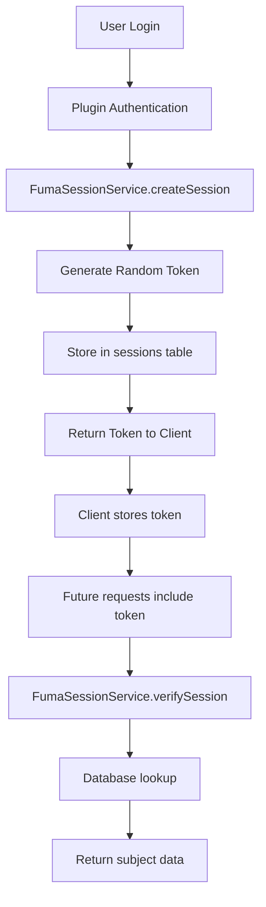
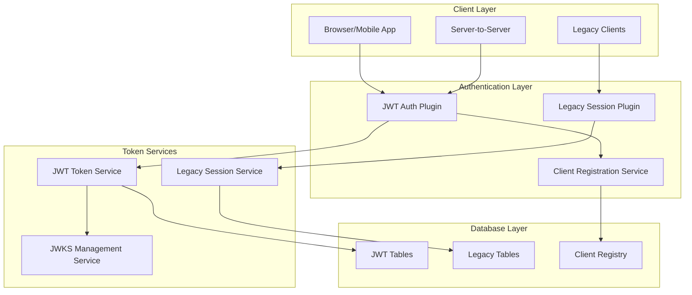
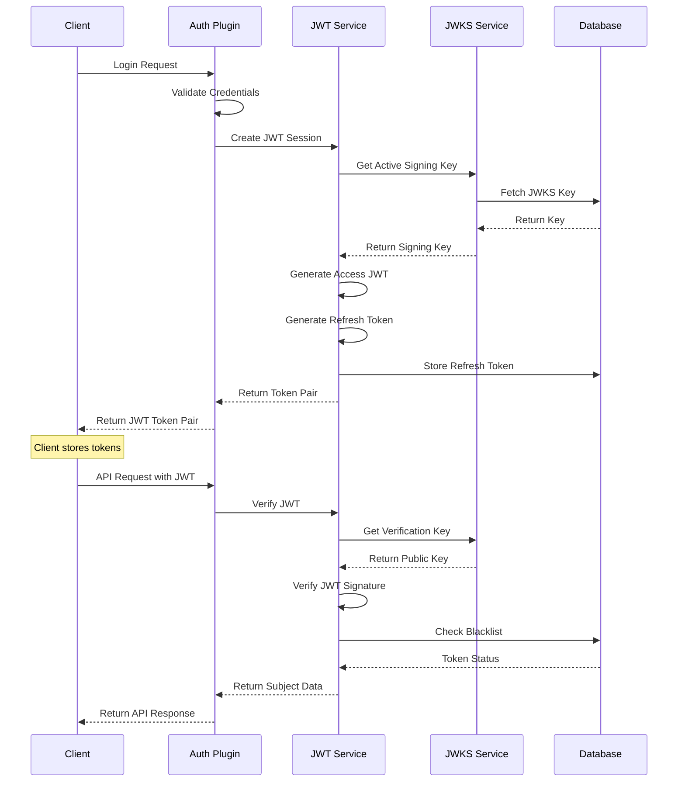
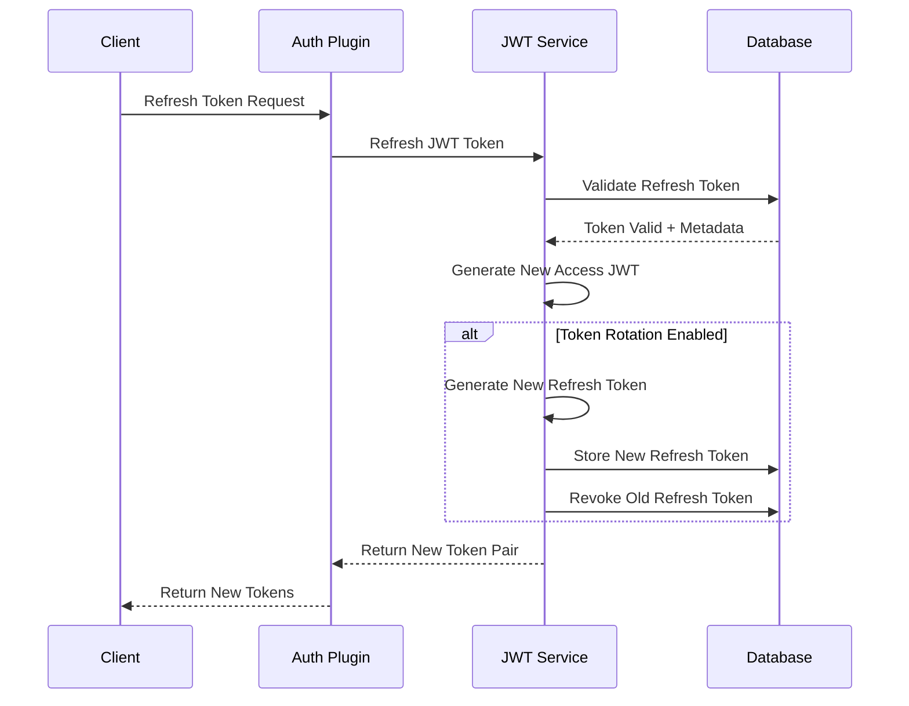
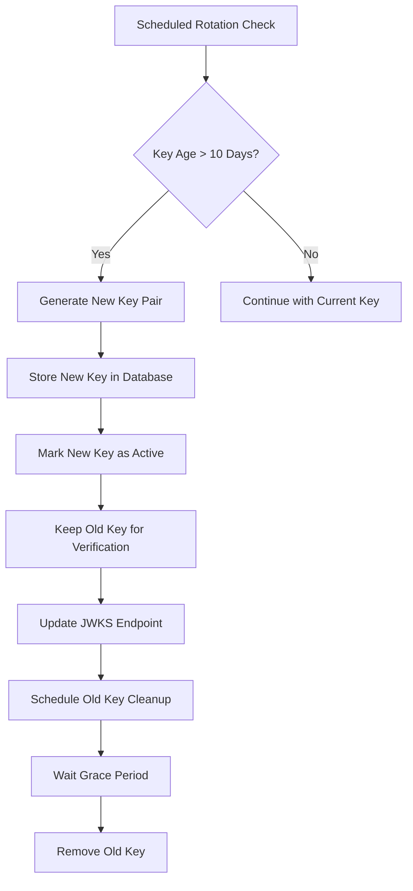

# JWT-Based Authentication System Architecture Design

## Current System Analysis

### Existing Architecture Overview

The current reauth system uses a **token-based session service** with the following key components:

#### Core Components
- **FumaSessionService**: Manages session lifecycle with random token generation
- **SessionResolvers**: Maps subject types to resolution logic
- **Plugin System**: Modular authentication providers (email-password, api-key, etc.)
- **Database Schema**: Uses FumaDB with core tables (sessions, subjects, credentials, identities)

#### Current Token Flow


#### Current Database Schema
- **sessions**: `id`, `subject_type`, `subject_id`, `token`, `expires_at`, `created_at`, `updated_at`
- **subjects**: Basic subject information
- **credentials**: Password hashes and metadata
- **identities**: Provider-specific identifiers
- **Enhanced session tables**: `session_devices`, `session_metadata` (when enhanced mode enabled)

#### Current JWKS Implementation
- Basic JWKS key generation and storage in `reauth_jwks` table
- RS256 algorithm support
- Simple key retrieval and JWT signing functions

### Limitations of Current System
1. **Stateful tokens**: Require database lookup for every verification
2. **No token refresh mechanism**: Sessions expire and require re-authentication
3. **Limited scalability**: Database dependency for token validation
4. **No client management**: No distinction between different client types
5. **Basic JWKS**: No key rotation or advanced key management

## Proposed JWT-Based System Design

### Architecture Overview

The new system will implement a **hybrid approach** supporting both legacy tokens and JWT-based authentication:



### New Database Schema Design

#### Client Registry Tables
```sql
-- OAuth-style client registration
CREATE TABLE oauth_clients (
    id VARCHAR(255) PRIMARY KEY,
    client_id VARCHAR(255) UNIQUE NOT NULL,
    client_secret_hash VARCHAR(255), -- NULL for public clients
    client_type ENUM('public', 'confidential') NOT NULL,
    name VARCHAR(255) NOT NULL,
    description TEXT,
    redirect_uris JSON, -- Array of allowed redirect URIs
    scopes JSON, -- Array of allowed scopes
    is_active BOOLEAN DEFAULT true,
    created_at TIMESTAMP DEFAULT CURRENT_TIMESTAMP,
    updated_at TIMESTAMP DEFAULT CURRENT_TIMESTAMP ON UPDATE CURRENT_TIMESTAMP
);

-- Client-specific configuration
CREATE TABLE client_configurations (
    id VARCHAR(255) PRIMARY KEY,
    client_id VARCHAR(255) NOT NULL,
    access_token_ttl_seconds INT DEFAULT 900, -- 15 minutes
    refresh_token_ttl_seconds INT DEFAULT 604800, -- 7 days
    allow_refresh_token_rotation BOOLEAN DEFAULT true,
    max_refresh_token_lifetime_seconds INT DEFAULT 2592000, -- 30 days
    created_at TIMESTAMP DEFAULT CURRENT_TIMESTAMP,
    updated_at TIMESTAMP DEFAULT CURRENT_TIMESTAMP ON UPDATE CURRENT_TIMESTAMP,
    FOREIGN KEY (client_id) REFERENCES oauth_clients(client_id)
);
```

#### Enhanced JWKS Tables
```sql
-- Enhanced JWKS key management
CREATE TABLE jwks_keys (
    id VARCHAR(255) PRIMARY KEY,
    key_id VARCHAR(255) UNIQUE NOT NULL, -- kid claim
    algorithm VARCHAR(10) NOT NULL DEFAULT 'RS256',
    public_key TEXT NOT NULL, -- JWK format
    private_key TEXT NOT NULL, -- JWK format
    is_active BOOLEAN DEFAULT true,
    created_at TIMESTAMP DEFAULT CURRENT_TIMESTAMP,
    expires_at TIMESTAMP, -- For key rotation
    last_used_at TIMESTAMP,
    usage_count INT DEFAULT 0
);

-- Key rotation history
CREATE TABLE jwks_key_rotations (
    id VARCHAR(255) PRIMARY KEY,
    old_key_id VARCHAR(255),
    new_key_id VARCHAR(255) NOT NULL,
    rotation_reason ENUM('scheduled', 'manual', 'compromise') NOT NULL,
    rotated_at TIMESTAMP DEFAULT CURRENT_TIMESTAMP,
    FOREIGN KEY (old_key_id) REFERENCES jwks_keys(key_id),
    FOREIGN KEY (new_key_id) REFERENCES jwks_keys(key_id)
);
```

#### JWT Token Management Tables
```sql
-- Refresh token storage and management
CREATE TABLE refresh_tokens (
    id VARCHAR(255) PRIMARY KEY,
    token_hash VARCHAR(255) UNIQUE NOT NULL, -- SHA-256 hash of refresh token
    subject_type VARCHAR(255) NOT NULL,
    subject_id VARCHAR(255) NOT NULL,
    client_id VARCHAR(255) NOT NULL,
    scopes JSON, -- Array of granted scopes
    expires_at TIMESTAMP NOT NULL,
    created_at TIMESTAMP DEFAULT CURRENT_TIMESTAMP,
    last_used_at TIMESTAMP,
    is_revoked BOOLEAN DEFAULT false,
    revoked_at TIMESTAMP NULL,
    parent_token_id VARCHAR(255), -- For token rotation tracking
    device_info JSON, -- Device fingerprint, user agent, etc.
    FOREIGN KEY (client_id) REFERENCES oauth_clients(client_id),
    INDEX idx_refresh_tokens_subject (subject_type, subject_id),
    INDEX idx_refresh_tokens_client (client_id),
    INDEX idx_refresh_tokens_expires (expires_at)
);

-- JWT token blacklist (for logout/revocation)
CREATE TABLE jwt_blacklist (
    id VARCHAR(255) PRIMARY KEY,
    jti VARCHAR(255) UNIQUE NOT NULL, -- JWT ID claim
    subject_type VARCHAR(255) NOT NULL,
    subject_id VARCHAR(255) NOT NULL,
    expires_at TIMESTAMP NOT NULL, -- When the JWT naturally expires
    blacklisted_at TIMESTAMP DEFAULT CURRENT_TIMESTAMP,
    reason ENUM('logout', 'revocation', 'security') NOT NULL,
    INDEX idx_jwt_blacklist_jti (jti),
    INDEX idx_jwt_blacklist_expires (expires_at)
);
```

### New Types and Interfaces

#### JWT-Specific Types
```typescript
// JWT Token Pair
export interface JWTTokenPair {
  accessToken: string; // JWT format
  refreshToken: string; // Opaque token
  tokenType: 'Bearer';
  expiresIn: number; // Access token TTL in seconds
  refreshExpiresIn: number; // Refresh token TTL in seconds
  scope?: string[]; // Granted scopes
}

// Client Registration
export interface OAuthClient {
  id: string;
  clientId: string;
  clientSecret?: string; // Only for confidential clients
  clientType: 'public' | 'confidential';
  name: string;
  description?: string;
  redirectUris: string[];
  scopes: string[];
  isActive: boolean;
  configuration: ClientConfiguration;
}

export interface ClientConfiguration {
  accessTokenTtlSeconds: number;
  refreshTokenTtlSeconds: number;
  allowRefreshTokenRotation: boolean;
  maxRefreshTokenLifetimeSeconds: number;
}

// Enhanced JWT Payload
export interface ReAuthJWTPayload extends JWTPayload {
  sub: string; // subject_id
  subject_type: string; // Custom claim for subject type
  client_id: string;
  scope?: string[];
  device_id?: string;
  session_id?: string; // Link to enhanced session if needed
}

// JWKS Key Management
export interface JWKSKey {
  id: string;
  keyId: string; // kid
  algorithm: string;
  publicKey: CryptoKey;
  privateKey: CryptoKey;
  isActive: boolean;
  createdAt: Date;
  expiresAt?: Date;
  usageCount: number;
}
```

#### Enhanced Session Service Interface
```typescript
export interface EnhancedSessionService extends SessionService {
  // JWT-specific methods
  createJWTSession(
    subjectType: string,
    subjectId: string,
    clientId: string,
    options: JWTSessionOptions
  ): Promise<JWTTokenPair>;
  
  verifyJWTToken(
    accessToken: string,
    options?: JWTVerificationOptions
  ): Promise<{ subject: any | null; payload: ReAuthJWTPayload | null }>;
  
  refreshJWTToken(
    refreshToken: string,
    clientId: string
  ): Promise<JWTTokenPair>;
  
  revokeJWTToken(
    token: string,
    tokenType: 'access' | 'refresh'
  ): Promise<void>;
  
  // Hybrid support
  verifyToken(
    token: string
  ): Promise<{ subject: any | null; token: string | null; type: 'jwt' | 'legacy' }>;
}
```

### JWT Authentication Flow



### Token Refresh Flow



### JWKS Key Rotation Strategy



### Migration Strategy

#### Phase 1: Infrastructure Setup
1. Deploy new database tables alongside existing ones
2. Implement JWT services without affecting current flow
3. Add JWKS endpoint for public key distribution

#### Phase 2: Hybrid Operation
1. Update session service to support both token types
2. Implement JWT authentication plugin
3. Allow clients to opt-in to JWT authentication

#### Phase 3: Gradual Migration
1. Migrate high-traffic clients to JWT
2. Monitor performance and security metrics
3. Provide migration tools for existing sessions

#### Phase 4: Legacy Deprecation
1. Mark legacy token system as deprecated
2. Provide migration timeline to clients
3. Eventually remove legacy token support

### Security Considerations

#### JWT Security Best Practices
- **Short-lived access tokens** (15 minutes) to limit exposure
- **Secure refresh token storage** with proper hashing
- **Token rotation** for refresh tokens to prevent replay attacks
- **Blacklist mechanism** for immediate token revocation
- **Scope-based authorization** for fine-grained access control

#### JWKS Security
- **Regular key rotation** (configurable, default 10 days)
- **Multiple active keys** for zero-downtime rotation
- **Key usage tracking** for security monitoring
- **Secure key storage** with proper encryption at rest

#### Client Security
- **Client authentication** for confidential clients
- **Redirect URI validation** for public clients
- **Scope validation** to prevent privilege escalation
- **Rate limiting** on token endpoints

### Performance Considerations

#### JWT Advantages
- **Stateless verification** reduces database load
- **Distributed verification** using public keys
- **Caching-friendly** JWKS endpoint
- **Horizontal scaling** without session affinity

#### Optimization Strategies
- **In-memory JWKS caching** with TTL
- **Async key rotation** to avoid blocking operations
- **Batch refresh token cleanup** for expired tokens
- **Connection pooling** for database operations

This design provides a comprehensive, secure, and scalable JWT-based authentication system while maintaining backward compatibility with the existing token-based approach.