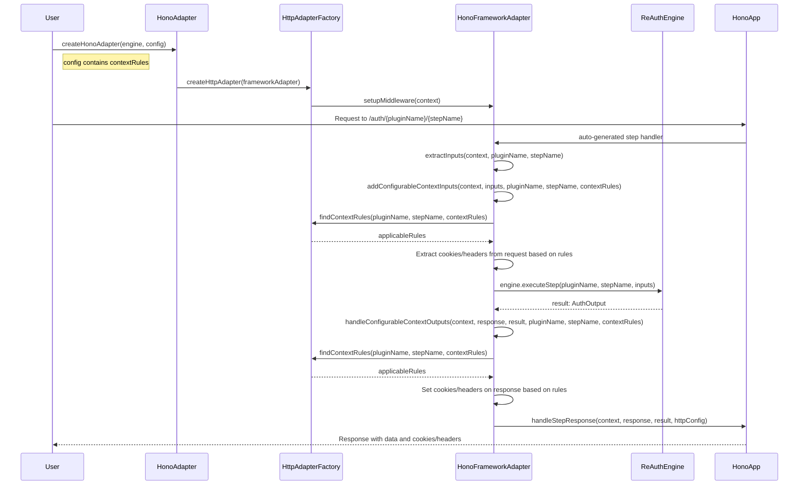

# @reauth/http-adapters

HTTP adapters for ReAuth authentication framework. This package provides HTTP server adapters to easily integrate ReAuth with various Node.js HTTP frameworks.

## Features

- **Auto-Introspection**: Automatically discovers all ReAuth plugins and creates HTTP routes for their steps
- **Framework Support**: Express.js, Fastify, and Hono adapters
- **Route Overriding**: Override any auto-generated plugin route with custom logic
- **Custom Routes**: Add additional routes for external plugins or custom functionality
- **Flexible Configuration**: Global middleware, custom error handlers, and more
- **TypeScript Support**: Full type safety with comprehensive interfaces

## Installation

```bash
pnpm add @reauth/http-adapters @reauth/reauth
```

## Available Adapters

- [Express](#express)
- [Fastify](#fastify)
- [Hono](#hono)
- [Nitro](#nitro)
- [H3](#h3)
- [Node.js HTTP](#node-http)

## Usage

### Express

```typescript
import express from 'express';
import { createExpressAdapter } from '@reauth/http-adapters/express';
import { reauth } from '@reauth/reauth';

const app = express();
const auth = reauth({
  // Your ReAuth configuration
});

app.use(express.json());
app.use(createExpressAdapter(auth));

app.listen(3000, () => {
  console.log('Server running on http://localhost:3000');
});
```

### Fastify

```typescript
import Fastify from 'fastify';
import { createFastifyAdapter } from '@reauth/http-adapters/fastify';
import { reauth } from '@reauth/reauth';

const app = Fastify();
const auth = reauth({
  // Your ReAuth configuration
});

app.register(createFastifyAdapter(auth));

app.listen({ port: 3000 }, (err) => {
  if (err) {
    console.error(err);
    process.exit(1);
  }
  console.log('Server running on http://localhost:3000');
});
```

## API Reference

### `createExpressAdapter(auth: ReAuth, options?: ExpressAdapterOptions)`

Creates an Express middleware function that handles ReAuth HTTP requests.

### `createFastifyAdapter(auth: ReAuth, options?: FastifyAdapterOptions)`

Creates a Fastify plugin that handles ReAuth HTTP requests.

## Development

1. Clone the repository
2. Install dependencies: `pnpm install`
3. Start development server: `pnpm dev`

## License

MIT

## Sequence Diagram


