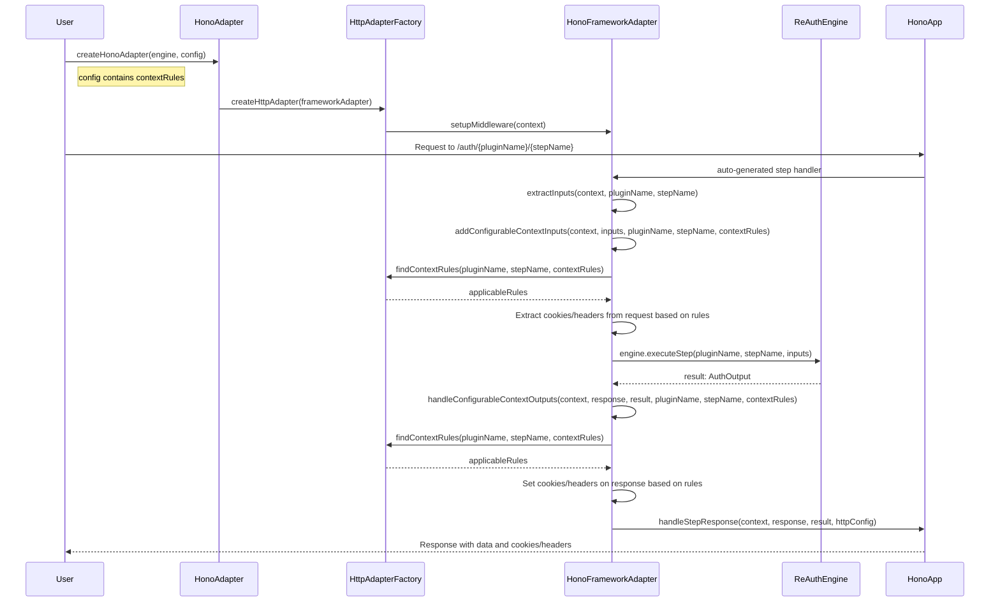

# 🌐 ReAuth HTTP Adapters - HTTP Protocol Implementation

ReAuth HTTP Adapters provide HTTP protocol implementation for the protocol-agnostic ReAuth Core engine. This package enables ReAuth to work with HTTP-based web frameworks through a unified adapter pattern, while the core authentication logic remains completely independent of the HTTP protocol.

## 🚀 Features

- **🔌 Protocol Adapter Pattern**: HTTP protocol implementation for the protocol-agnostic ReAuth Core
- **🎯 Framework Universal**: Express.js, Fastify, and Hono framework adapters with unified interface
- **📡 Auto-Introspection**: Automatic HTTP route generation from ReAuth plugin introspection
- **🛠️ Route Customization**: Override auto-generated routes or add custom HTTP endpoints
- **🍪 Context Management**: HTTP-specific cookie and header handling with configurable rules
- **🔒 HTTP Middleware**: Authentication middleware and route protection for HTTP frameworks
- **✅ Type Safety**: Full TypeScript support with comprehensive HTTP-specific interfaces
- **🏭 Adapter Factory**: Generic pattern for creating custom HTTP framework adapters

## 📦 Installation

```bash
# Install both the core engine and HTTP adapters
npm install @re-auth/reauth @re-auth/http-adapters

# Or with your preferred package manager
pnpm add @re-auth/reauth @re-auth/http-adapters
yarn add @re-auth/reauth @re-auth/http-adapters
```

## 🏗️ Architecture Overview

ReAuth HTTP Adapters implement the HTTP protocol for the protocol-agnostic ReAuth Core engine:

```
┌─────────────────────────────────────────────────────────────┐
│                    ReAuth Core Engine                       │
│              (Protocol-Agnostic)                           │
│                                                             │
│  • Plugin System (OAuth, Email/Password, etc.)             │
│  • Session Management                                       │
│  • Entity Services (Abstract)                              │
│  • Authentication Logic                                     │
└─────────────────────────────────────────────────────────────┘
                              │
                              ▼
┌─────────────────────────────────────────────────────────────┐
│                HTTP Protocol Adapters                      │
│              (@re-auth/http-adapters)                      │
│                                                             │
│  • HTTP Adapter Factory                                     │
│  • Auto-Route Generation                                    │
│  • Context Rules (Cookies/Headers)                         │
│  • Framework Abstraction Layer                             │
└─────────────────────────────────────────────────────────────┘
                              │
                              ▼
┌─────────────────────────────────────────────────────────────┐
│                Framework Integrations                      │
│                                                             │
│  ┌─────────────┐  ┌─────────────┐  ┌─────────────────────┐ │
│  │ Express.js  │  │ Fastify     │  │ Hono                │ │
│  │ Adapter     │  │ Adapter     │  │ Adapter             │ │
│  └─────────────┘  └─────────────┘  └─────────────────────┘ │
└─────────────────────────────────────────────────────────────┘
```

### Key Principles

- **Protocol Implementation**: HTTP adapters translate between HTTP requests/responses and the protocol-agnostic core engine
- **Framework Abstraction**: Each framework adapter implements a common interface while handling framework-specific details
- **Auto-Introspection**: HTTP routes are automatically generated from ReAuth plugin definitions
- **Context Management**: HTTP-specific concerns (cookies, headers, sessions) are handled at the adapter level

## 🎯 Supported Frameworks

- **Express.js** - Full-featured Express middleware with route protection
- **Fastify** - High-performance Fastify plugin with hooks integration
- **Hono** - Modern edge-runtime compatible adapter for Hono framework

## 🛠️ Getting Started

### Basic HTTP Integration

The HTTP adapters translate between HTTP requests/responses and the protocol-agnostic ReAuth Core engine:

```typescript
import { ReAuthEngine, emailPasswordAuth } from '@re-auth/reauth';
import { MyEntityService, MySessionService } from './services';

// 1. Set up the protocol-agnostic core engine
const entityService = new MyEntityService();
const sessionService = new MySessionService();

const auth = new ReAuthEngine({
  plugins: [
    emailPasswordAuth({
      /* config */
    }),
  ],
  entity: entityService,
  session: sessionService,
});

// 2. Use HTTP adapters to integrate with your framework
// (See framework-specific examples below)
```

### Express.js Integration

```typescript
import express from 'express';
import { createExpressAdapter } from '@re-auth/http-adapters';

const app = express();
app.use(express.json());

// Create Express HTTP adapter
const expressAdapter = createExpressAdapter(auth, {
  routes: { prefix: '/auth' },
  cookieName: 'auth_token',
  cookieOptions: {
    httpOnly: true,
    secure: process.env.NODE_ENV === 'production',
    sameSite: 'lax',
  },
});

// Use the adapter router
app.use(expressAdapter.getRouter());

// Add route protection
app.get('/protected', expressAdapter.protect(), (req, res) => {
  res.json({ message: 'Protected route', user: req.user });
});

app.listen(3000, () => {
  console.log('Server running on http://localhost:3000');
});
```

### Fastify Integration

```typescript
import Fastify from 'fastify';
import { createFastifyAdapter } from '@re-auth/http-adapters';

const fastify = Fastify();

// Create Fastify HTTP adapter
const fastifyAdapter = createFastifyAdapter(fastify, auth, {
  prefix: '/auth',
  cookieName: 'auth_token',
  cookieOptions: {
    httpOnly: true,
    secure: process.env.NODE_ENV === 'production',
    sameSite: 'lax',
  },
});

// Add protected route
fastify.get('/protected', {
  preHandler: [fastifyAdapter.protect()],
  handler: async (request, reply) => {
    return { message: 'Protected route', user: request.user };
  },
});

fastify.listen({ port: 3000 }, (err) => {
  if (err) throw err;
  console.log('Server running on http://localhost:3000');
});
```

### Hono Integration

```typescript
import { Hono } from 'hono';
import { createHonoAdapter } from '@re-auth/http-adapters';

const app = new Hono();

// Create Hono HTTP adapter
const honoAdapter = createHonoAdapter(
  auth,
  {
    routes: { prefix: '/auth' },
    cookieName: 'auth_token',
    cookieOptions: {
      httpOnly: true,
      secure: true,
      sameSite: 'Lax',
    },
  },
  app,
);

// Add protected route
app.get('/protected', honoAdapter.protect(), (c) => {
  return c.json({
    message: 'Protected route',
    user: c.get('entity'),
  });
});

export default app;
```

## 🔧 Advanced Configuration

### Auto-Introspection and Route Generation

HTTP adapters automatically generate routes based on ReAuth plugin introspection:

```typescript
import { createHttpAdapter, createAutoIntrospectionConfig } from '@re-auth/http-adapters';

const httpAdapter = createHttpAdapter(frameworkAdapter)(auth, {
  routes: { prefix: '/auth' },
  introspection: createAutoIntrospectionConfig({
    enabled: true,
    endpoint: '/introspect',
    includeSchemas: true,
  }),
});
```

### Context Rules for Cookies and Headers

Configure HTTP-specific context extraction and response handling:

```typescript
import { createContextRule, OAuth2ContextRules } from '@re-auth/http-adapters';

const contextRules = [
  // Extract OAuth state from cookies
  createContextRule({
    pluginName: 'oauth',
    stepName: 'callback',
    extractCookies: ['oauth_state', 'oauth_verifier'],
    setCookies: ['access_token', 'refresh_token'],
  }),

  // Use pre-built OAuth2 context rules
  ...OAuth2ContextRules,
];

const adapter = createExpressAdapter(auth, {
  contextRules,
  cookieName: 'auth_token',
});
```

### Route Overrides and Custom Routes

Override auto-generated routes or add custom HTTP endpoints:

```typescript
import { createRouteOverride, createCustomRoute } from '@re-auth/http-adapters';

const routeOverrides = [
  createRouteOverride({
    pluginName: 'email-password',
    stepName: 'login',
    handler: async (req, res) => {
      // Custom login logic
      const result = await auth.executeStep('email-password', 'login', req.body);
      res.json(result);
    },
  }),
];

const customRoutes = [
  createCustomRoute({
    method: 'GET',
    path: '/auth/status',
    handler: async (req, res) => {
      res.json({ authenticated: req.isAuthenticated() });
    },
  }),
];

const adapter = createExpressAdapter(auth, {
  routeOverrides,
  customRoutes,
});
```

## 📚 API Reference

### Core HTTP Adapter Factory

```typescript
import { createHttpAdapter, type FrameworkAdapter } from '@re-auth/http-adapters';

// Generic HTTP adapter factory
const httpAdapter = createHttpAdapter<TConfig>(frameworkAdapter: FrameworkAdapter<TConfig>);
```

### Express.js Adapter

```typescript
import { createExpressAdapter, type ExpressAdapterConfig } from '@re-auth/http-adapters';

const expressAdapter = createExpressAdapter(
  engine: ReAuthEngine,
  config?: ExpressAdapterConfig
);

// Configuration options
interface ExpressAdapterConfig extends BaseHttpConfig {
  // Express-specific options
}
```

### Fastify Adapter

```typescript
import { createFastifyAdapter, type FastifyAdapterConfig } from '@re-auth/http-adapters';

const fastifyAdapter = createFastifyAdapter(
  fastify: FastifyInstance,
  engine: ReAuthEngine,
  config?: FastifyAdapterConfig
);

// Configuration options
interface FastifyAdapterConfig extends BaseHttpConfig {
  prefix?: string;
}
```

### Hono Adapter

```typescript
import { createHonoAdapter, type HonoAdapterConfig } from '@re-auth/http-adapters';

const honoAdapter = createHonoAdapter(
  engine: ReAuthEngine,
  config?: HonoAdapterConfig,
  app: Hono
);

// Configuration options
interface HonoAdapterConfig extends BaseHttpConfig {
  // Hono-specific options
}
```

### Base HTTP Configuration

```typescript
interface BaseHttpConfig {
  routes?: {
    prefix?: string;
  };
  cookieName?: string;
  cookieOptions?: {
    httpOnly?: boolean;
    secure?: boolean;
    sameSite?: 'strict' | 'lax' | 'none';
    maxAge?: number;
    domain?: string;
    path?: string;
  };
  contextRules?: ContextExtractionRule[];
  routeOverrides?: RouteOverride[];
  customRoutes?: CustomRoute[];
  introspection?: AutoIntrospectionConfig;
  globalMiddleware?: any[];
}
```

## 🛠️ Creating Custom HTTP Adapters

To create a custom HTTP adapter for a new framework, implement the `FrameworkAdapter` interface:

```typescript
import { FrameworkAdapter, HttpAdapterContext, AuthOutput } from '@re-auth/http-adapters';

class MyFrameworkAdapter implements FrameworkAdapter<MyConfig> {
  setupMiddleware(context: HttpAdapterContext): void {
    // Set up framework-specific middleware
  }

  createRoute(method: string, path: string, handler: any, middleware?: any[]): void {
    // Create routes in your framework
  }

  async extractInputs(request: any, pluginName: string, stepName: string): Promise<Record<string, any>> {
    // Extract inputs from framework request
  }

  handleStepResponse(request: any, response: any, result: AuthOutput, httpConfig: any): void {
    // Handle framework response
  }

  extractToken(request: any): string | null {
    // Extract authentication token
  }

  requireAuth(): any {
    // Return authentication middleware
  }

  errorResponse(response: any, error: Error): void {
    // Handle error responses
  }

  getAdapter(): any {
    // Return framework instance
  }
}
```

## 🔍 HTTP Protocol Features

### Automatic Route Generation

Routes are automatically generated based on plugin step definitions:

- `POST /auth/{pluginName}/{stepName}` - Execute authentication step
- `GET /auth/introspect` - Get plugin and step information (if enabled)
- Custom routes based on plugin HTTP configuration

### Session Management

HTTP adapters handle session management through:

- **Cookies**: Secure HTTP-only cookies for session tokens
- **Headers**: Authorization header support (`Bearer {token}`)
- **Automatic cleanup**: Invalid tokens are automatically cleared

### Error Handling

Comprehensive error handling with appropriate HTTP status codes:

- `400` - Bad Request (validation errors, missing inputs)
- `401` - Unauthorized (authentication required)
- `403` - Forbidden (insufficient permissions)
- `409` - Conflict (duplicate resources)
- `500` - Internal Server Error

## 📝 License

MIT

## Sequence Diagram


