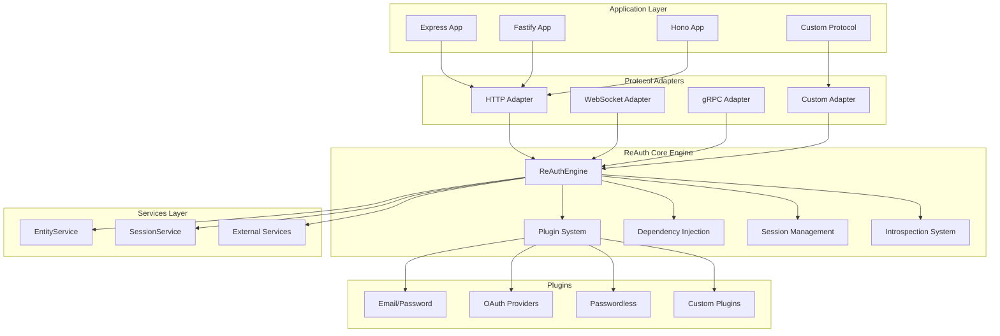
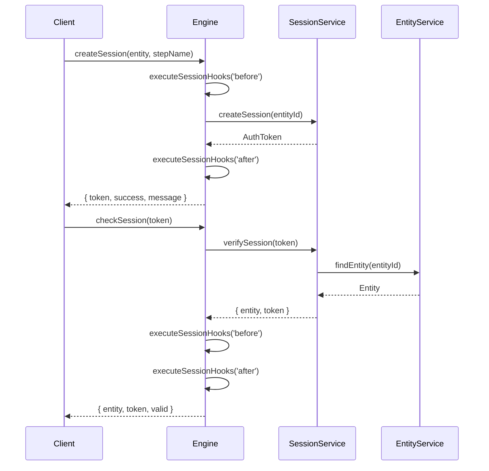

# ReAuth Architecture

ReAuth is a **runtime, framework, and protocol-independent** authentication engine built on a plugin-based architecture with clean separation of concerns. This document explains the core design principles, architectural patterns, and extension points that make ReAuth a universal authentication solution.

## Core Design Principles

### 1. Protocol Independence

ReAuth's core engine is completely protocol-agnostic. It doesn't assume HTTP, WebSocket, gRPC, or any specific communication protocol. Instead, it provides abstract interfaces that can be implemented by protocol-specific adapters.

```typescript
// Core engine works with abstract services
interface EntityService {
  findEntity(id: string, field: string): Promise<Entity | null>;
  createEntity(entity: Partial<Entity>): Promise<Entity>;
  updateEntity(id: string, field: string, entity: Partial<Entity>): Promise<Entity>;
  deleteEntity(id: string, field: string): Promise<void>;
}

interface SessionService {
  createSession(entityId: string): Promise<AuthToken>;
  verifySession(token: string): Promise<{ entity: Entity | null; token: AuthToken }>;
  destroySession(token: string): Promise<void>;
  destroyAllSessions(entityId: string): Promise<void>;
}
```

### 2. Runtime Agnostic

The engine works across all JavaScript runtimes (Node.js, Deno, Bun, browsers, edge runtimes) without modification. This is achieved by:

- Using only standard JavaScript/TypeScript features
- Avoiding runtime-specific APIs in the core
- Delegating runtime-specific operations to service implementations
- Supporting both ESM and CommonJS module formats

### 3. Framework Universal

ReAuth doesn't tie itself to any specific framework. Instead, it uses the adapter pattern to integrate with different frameworks through protocol-specific adapters:

```typescript
// Core engine is framework-agnostic
const auth = new ReAuthEngine({
  plugins: [emailPasswordAuth()],
  entity: entityService, // Your implementation
  session: sessionService, // Your implementation
});

// Framework integration happens through adapters
const httpAdapter = createHttpAdapter(auth); // For HTTP frameworks
const wsAdapter = createWebSocketAdapter(auth); // For WebSocket protocols
```

## Architecture Overview



## Plugin System Architecture

### Plugin Interface

Every authentication method in ReAuth is implemented as a plugin that conforms to the `AuthPlugin` interface:

```typescript
interface AuthPlugin<T = any> {
  name: string; // Unique plugin identifier
  steps: AuthStep<T>[]; // Authentication steps
  initialize(container: AwilixContainer): Promise<void> | void;
  getSensitiveFields?(): string[]; // Fields to redact in logs
  migrationConfig?: PluginMigrationConfig; // Database schema extensions
  config: Partial<T>; // Plugin configuration
  dependsOn?: string[]; // Plugin dependencies
  runStep?(step: string, input: AuthInput, container: AwilixContainer): Promise<AuthOutput>;
  rootHooks?: RootStepHooks; // Plugin-level hooks
}
```

### Authentication Steps

Each plugin defines discrete authentication steps that represent specific operations:

```typescript
interface AuthStep<T> {
  name: string; // Step identifier (e.g., "login", "register")
  description: string; // Human-readable description
  validationSchema?: Type<any>; // ArkType validation schema
  outputs?: Type<any>; // Expected output schema
  inputs: string[]; // Required input fields
  hooks?: AuthStepHooks; // Step-level hooks
  protocol: {
    // Protocol-specific metadata
    http?: {
      method: string; // HTTP method for this step
      auth?: boolean; // Requires authentication
      [key: string]: any; // Custom protocol data
    };
    [key: string]: any; // Other protocol configurations
  };
  run(input: AuthInput, pluginProperties?: PluginProp<T>): Promise<AuthOutput>;
}
```

### Plugin Types

ReAuth supports two plugin implementation patterns:

#### 1. Object-Based Plugins (Stateless)

Best for simple, stateless authentication methods:

```typescript
const emailPasswordPlugin: AuthPlugin = {
  name: 'email-password',
  steps: [
    {
      name: 'login',
      description: 'Authenticate with email and password',
      async run(input, { container, config }) {
        // Authentication logic here
        return { success: true, message: 'Login successful' };
      },
      inputs: ['email', 'password'],
      protocol: { http: { method: 'POST' } },
    },
  ],
  initialize(container) {
    // Plugin initialization
  },
  config: {},
};
```

#### 2. Class-Based Plugins (Stateful)

Best for complex plugins that need internal state:

```typescript
class OAuthPlugin implements AuthPlugin {
  name = 'oauth';
  private providers: Map<string, OAuthProvider> = new Map();

  constructor(private config: OAuthConfig) {}

  async initialize(container: AwilixContainer) {
    // Initialize OAuth providers
  }

  steps = [
    {
      name: 'oauth-login',
      run: this.handleOAuthLogin.bind(this),
      // ... other step properties
    },
  ];

  private async handleOAuthLogin(input: AuthInput) {
    // OAuth-specific logic with access to this.providers
  }
}
```

### Plugin Factory Pattern

ReAuth provides a factory function for creating configurable plugins:

```typescript
import { createAuthPlugin } from '@re-auth/reauth';

const emailPasswordAuth = (config: EmailPasswordConfig = {}) => {
  return createAuthPlugin(config, basePlugin, stepOverrides, defaultConfig);
};

// Usage
const plugin = emailPasswordAuth({
  verifyEmail: true,
  loginOnRegister: false,
  async sendCode(entity, code, email, type) {
    // Custom email sending logic
  },
});
```

## Dependency Injection Container

ReAuth uses [Awilix](https://github.com/jeffijoe/awilix) for dependency injection, providing clean architecture and testability.

### Container Structure

```typescript
interface ReAuthCradle {
  // Core services (required)
  entityService: EntityService;
  sessionService: SessionService;

  // Utility services
  sensitiveFields: SensitiveFields;
  serializeEntity: <T extends Entity>(entity: T) => T;
  reAuthEngine: ReAuthEngine;

  // Plugin-specific services (registered by plugins)
  [key: string]: any;
}
```

### Service Registration

The engine automatically registers core services and allows plugins to register additional services:

```typescript
// Core services are registered automatically
this.container.register({
  entityService: asValue(config.entity),
  sessionService: asValue(config.session),
  sensitiveFields: asValue(this.sensitiveFields),
  serializeEntity: asValue(this.serializeEntity.bind(this)),
  reAuthEngine: asValue(this),
});

// Plugins can register additional services during initialization
class MyPlugin implements AuthPlugin {
  async initialize(container: AwilixContainer) {
    container.register({
      myService: asClass(MyService).singleton(),
      myConfig: asValue(this.config),
    });
  }
}
```

### Service Access

Services are accessed through the container in plugin steps:

```typescript
{
  name: 'login',
  async run(input, { container }) {
    // Access core services
    const entityService = container.cradle.entityService;
    const sessionService = container.cradle.sessionService;

    // Access plugin-specific services
    const myService = container.cradle.myService;

    // Use services for authentication logic
    const entity = await entityService.findEntity(input.email, 'email');
    const token = await sessionService.createSession(entity.id);

    return { success: true, token };
  }
}
```

## Hook System

ReAuth provides a comprehensive hook system for extending and customizing authentication flows at multiple levels.

### Hook Types

```typescript
type HooksType = 'before' | 'after' | 'onError';

type HookFunction = (data: AuthInput | AuthOutput, container: AwilixContainer<ReAuthCradle>, error?: Error) => Promise<AuthOutput | AuthInput | void>;
```

### Step-Level Hooks

Individual steps can define hooks for fine-grained control:

```typescript
{
  name: 'login',
  hooks: {
    before: [
      async (input, container) => {
        // Pre-process input
        console.log('Login attempt for:', input.email);
        return input;
      }
    ],
    after: [
      async (output, container) => {
        // Post-process output
        if (output.success) {
          console.log('Successful login for:', output.entity?.email);
        }
        return output;
      }
    ],
    onError: [
      async (error, input, container) => {
        // Handle errors
        console.error('Login failed:', error.message);
      }
    ]
  },
  async run(input) {
    // Step logic
  }
}
```

### Plugin-Level Hooks (Root Hooks)

Plugins can define hooks that apply to all their steps:

```typescript
const plugin: AuthPlugin = {
  name: 'my-plugin',
  rootHooks: {
    before: async (input, container, step) => {
      // Runs before any step in this plugin
      return input;
    },
    after: async (output, container, step) => {
      // Runs after any step in this plugin
      return output;
    },
    onError: async (error, input, container, step) => {
      // Runs when any step in this plugin errors
    },
  },
  steps: [
    /* ... */
  ],
};
```

### Global Hooks

The engine supports global hooks that can be registered for specific steps or universally:

```typescript
// Register a global hook for specific steps
auth.registerAuthHook({
  pluginName: 'global',
  type: 'before',
  steps: ['login', 'register'],
  fn: async (data, container) => {
    // Runs before login or register steps from any plugin
    return data;
  },
});

// Register a universal hook
auth.registerAuthHook({
  pluginName: 'global',
  type: 'after',
  universal: true,
  fn: async (data, container) => {
    // Runs after every step from every plugin
    return data;
  },
});
```

### Session Hooks

Special hooks for session-related operations:

```typescript
// Register session-specific hooks
auth.registerSessionHook('before', async (data, container) => {
  // Runs before session creation/validation
  return data;
});

auth.registerSessionHook('after', async (data, container) => {
  // Runs after session creation/validation
  return data;
});
```

## Session Management

ReAuth provides protocol-agnostic session management through the `SessionService` interface.

### Session Lifecycle



### Session Creation

```typescript
async createSession(entity: Entity, stepName: string): Promise<{
  token: AuthToken;
  success: boolean;
  message?: string;
  error?: Error;
}> {
  try {
    // Run before hooks
    const processedInput = await this.executeSessionHooks('before', { entity }, stepName);

    // Create session through service
    const token = await this.container.cradle.sessionService.createSession(entity.id);

    // Run after hooks
    const output = { entity, token, success: true, message: 'Session created' };
    const processedOutput = await this.executeSessionHooks('after', output, stepName);

    return processedOutput;
  } catch (error) {
    // Run error hooks
    await this.executeSessionHooks('onError', { entity }, stepName, error);
    throw error;
  }
}
```

### Session Validation

```typescript
async checkSession(token: string): Promise<{
  entity: Entity | null;
  token: AuthToken;
  valid: boolean;
  message?: string;
  error?: Error;
}> {
  try {
    // Verify through service
    const result = await this.container.cradle.sessionService.verifySession(token);

    if (!result.entity || !result.token) {
      return { entity: null, token: null, valid: false };
    }

    // Run validation hooks
    const input = { entity: result.entity, token: result.token };
    const processedInput = await this.executeSessionHooks('before', input, '');

    const output = { ...processedInput, success: true, valid: true };
    const processedOutput = await this.executeSessionHooks('after', output, '');

    return processedOutput;
  } catch (error) {
    await this.executeSessionHooks('onError', { token }, '', error);
    return { entity: null, token: null, valid: false, error };
  }
}
```

## Introspection System

ReAuth provides comprehensive introspection capabilities for automatic API discovery and SDK generation.

### Introspection Data Structure

```typescript
interface IntrospectionResult {
  entity: EntitySchema; // Complete entity schema
  plugins: IntrospectionPlugin[]; // All plugins with their steps
  generatedAt: string; // Generation timestamp
  version: string; // ReAuth version
}

interface IntrospectionPlugin {
  name: string;
  description: string;
  steps: IntrospectionStep[];
}

interface IntrospectionStep {
  name: string;
  description: string;
  inputs: Record<string, any>; // ArkType schema as JSON
  outputs: Record<string, any>; // ArkType schema as JSON
  protocol: {
    http?: {
      method: string;
      auth?: boolean;
      [key: string]: any;
    };
    [key: string]: any;
  };
  requiresAuth: boolean;
}
```

### Entity Schema Generation

The introspection system automatically generates comprehensive entity schemas by combining:

1. **Base Entity Fields**: Standard fields (id, role, timestamps)
2. **Plugin Extensions**: Fields added by plugin migration configs

```typescript
private extractEntitySchema(migrationConfig: MigrationConfig): EntitySchema {
  const baseEntityFields: Record<string, FieldSchema> = {
    id: { type: 'string', required: true, description: 'Unique entity identifier' },
    role: { type: 'string', required: true, description: 'Entity role' },
    created_at: { type: 'string', format: 'date-time', required: true },
    updated_at: { type: 'string', format: 'date-time', required: true },
  };

  // Collect fields from plugin extensions
  const extendedFields: Record<string, FieldSchema> = {};

  migrationConfig.plugins.forEach((pluginConfig) => {
    if (pluginConfig.extendTables) {
      pluginConfig.extendTables.forEach((tableExtension) => {
        if (tableExtension.tableName === 'entities') {
          Object.entries(tableExtension.columns).forEach(([fieldName, column]) => {
            extendedFields[fieldName] = {
              type: this.mapColumnTypeToTsType(column.type),
              format: this.getColumnFormat(column.type),
              required: !column.nullable,
              description: `${fieldName} field from ${pluginConfig.pluginName} plugin`,
            };
          });
        }
      });
    }
  });

  return {
    type: 'object',
    properties: { ...baseEntityFields, ...extendedFields },
    required: Object.entries({ ...baseEntityFields, ...extendedFields })
      .filter(([_, field]) => field.required)
      .map(([name]) => name),
  };
}
```

### Plugin Step Introspection

Each plugin step is introspected to extract:

- Input/output schemas from ArkType definitions
- Protocol-specific metadata
- Authentication requirements

```typescript
getIntrospectionData(): IntrospectionResult {
  const plugins = this.plugins.map((plugin) => ({
    name: plugin.name,
    description: `${plugin.name} authentication plugin`,
    steps: plugin.steps.map((step) => ({
      name: step.name,
      description: step.description,
      inputs: step.validationSchema?.toJsonSchema() || {},
      outputs: step.outputs?.toJsonSchema() || {},
      protocol: step.protocol,
      requiresAuth: step.protocol.http?.auth || false,
    })),
  }));

  return {
    entity: this.extractEntitySchema(this.getMirgrationCongfig()),
    plugins,
    generatedAt: new Date().toISOString(),
    version: '1.0.0',
  };
}
```

### SDK Generation Process

The introspection data enables automatic SDK generation:

1. **Schema Analysis**: Extract all entity fields, step inputs/outputs
2. **Type Generation**: Generate TypeScript interfaces from schemas
3. **Client Generation**: Create protocol-specific client methods
4. **Documentation**: Generate API documentation from descriptions

```typescript
// Example generated SDK structure
interface GeneratedSDK {
  // Entity types
  Entity: EntityInterface;

  // Plugin clients
  emailPassword: {
    login(input: LoginInput): Promise<LoginOutput>;
    register(input: RegisterInput): Promise<RegisterOutput>;
    verifyEmail(input: VerifyEmailInput): Promise<VerifyEmailOutput>;
  };

  oauth: {
    googleLogin(input: OAuthInput): Promise<OAuthOutput>;
    githubLogin(input: OAuthInput): Promise<OAuthOutput>;
  };
}
```

## Migration System

ReAuth includes a database-agnostic migration system that allows plugins to extend the base entity schema.

### Base Schema

```typescript
interface MigrationConfig {
  migrationName: string;
  outputDir: string;
  baseTables: TableSchema[]; // Core tables (entities, sessions)
  plugins: PluginMigrationConfig[]; // Plugin extensions
}
```

### Plugin Schema Extensions

Plugins can extend the base entity table or create new tables:

```typescript
interface PluginMigrationConfig {
  pluginName: string;
  tables?: TableSchema[]; // New tables
  extendTables?: Array<{
    // Extend existing tables
    tableName: string;
    columns: Record<string, ColumnDefinition>;
    indexes?: Array<{
      columns: string[];
      name?: string;
      unique?: boolean;
    }>;
  }>;
}
```

### Example Plugin Migration

```typescript
const emailPasswordPlugin: AuthPlugin = {
  name: 'email-password',
  migrationConfig: {
    pluginName: 'email-password',
    extendTables: [
      {
        tableName: 'entities',
        columns: {
          email: {
            type: 'string',
            nullable: false,
            unique: true,
            index: true,
          },
          email_verified: {
            type: 'boolean',
            index: true,
            defaultValue: false,
          },
          password_hash: {
            type: 'string',
            nullable: true,
          },
          email_verification_code: {
            type: 'string',
            nullable: true,
          },
        },
      },
    ],
  },
  // ... rest of plugin
};
```

## Validation System

ReAuth uses [ArkType](https://arktype.io/) for comprehensive type-safe validation throughout the system.

### Schema Definition

```typescript
import { type } from 'arktype';

const loginSchema = type({
  email: 'string.email',
  password: 'string >= 8',
  'others?': 'object | undefined',
});
```

### Validation Integration

Validation is automatically applied to step inputs:

```typescript
{
  name: 'login',
  validationSchema: loginSchema,
  async run(input, { container }) {
    // Input is automatically validated before this runs
    // TypeScript knows input conforms to the schema
    const { email, password } = input;
    // ... authentication logic
  }
}
```

### Custom Validation

Plugins can implement custom validation logic:

```typescript
async function validateInputWithValidationSchema(schema: Type<any>, input: Record<string, any>): Promise<ValidationResult> {
  try {
    schema.assert(input);
    return { isValid: true };
  } catch (error) {
    if (error instanceof TraversalError) {
      return {
        isValid: false,
        errors: { _error: error.message },
      };
    }
    return {
      isValid: false,
      errors: { _error: 'Unknown validation error' },
    };
  }
}
```

## Error Handling

ReAuth provides structured error handling with specific error types for different scenarios.

### Error Types

```typescript
class PluginNotFound extends Error {
  constructor(plugin: string) {
    super(`Plugin ${plugin} not found`);
    this.name = 'PluginNotFound';
  }
}

class StepNotFound extends Error {
  constructor(step: string, pluginName: string) {
    super(`Step ${step} not found for plugin ${pluginName}`);
    this.name = 'StepNotFound';
  }
}

class ValidationError extends Error {
  constructor(
    message: string,
    public pluginName: string,
    public stepName: string,
    public hookType?: HooksType,
    public data?: any,
  ) {
    super(message);
    this.name = 'ValidationError';
  }
}
```

### Error Propagation

Errors are handled at multiple levels:

1. **Step Level**: Individual step error hooks
2. **Plugin Level**: Plugin root error hooks
3. **Global Level**: Engine-wide error hooks
4. **Protocol Level**: Adapter-specific error handling

```typescript
try {
  const result = await auth.executeStep('email', 'login', input);
} catch (error) {
  if (error instanceof ValidationError) {
    // Handle validation errors
  } else if (error instanceof PluginNotFound) {
    // Handle missing plugin errors
  } else {
    // Handle other errors
  }
}
```

## Extension Points

ReAuth provides multiple extension points for customization:

### 1. Custom Plugins

Create new authentication methods by implementing the `AuthPlugin` interface.

### 2. Protocol Adapters

Integrate with new protocols by creating adapters that bridge the core engine with protocol-specific frameworks.

### 3. Service Implementations

Provide custom implementations of `EntityService` and `SessionService` for different data layers.

### 4. Hook System

Extend functionality through the comprehensive hook system at step, plugin, and global levels.

### 5. Validation Extensions

Add custom validation logic using ArkType schemas or custom validation functions.

### 6. Migration Extensions

Extend the database schema through plugin migration configurations.

This architecture enables ReAuth to serve as a truly universal authentication solution that can adapt to any runtime, framework, protocol, or use case while maintaining clean separation of concerns and extensibility.
